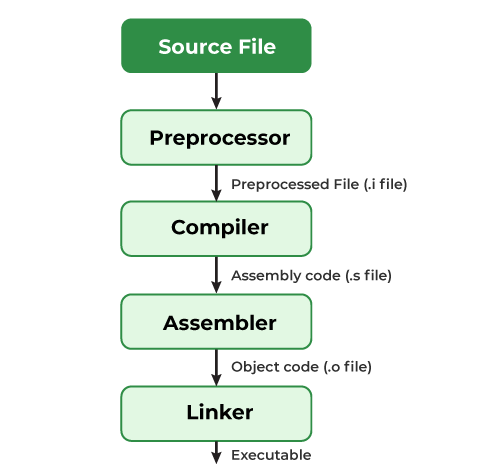

# C Notes

- **What is a Size of a Pointer in C ?**
  The size of a pointer in C can differ based on factors like CPU architecture and the operating system of a computer. Usually, ==the size of a pointer is 4 bytes== on a 32-bit computer system, and on a 64-bit computer system, the pointer size is 8 bytes.
  ==It is common to all data types== like int _, float_ etc.

## extern Keyword in C

extern keyword in C applies to C variables (data objects) and C functions. Basically, the extern keyword **extends the visibility of the C variables and C functions**. That’s probably the reason why it was named extern.

Though most people probably understand the difference between the “declaration” and the “definition” of a variable or function, for the sake of completeness, let’s clarify it

- **Declaration** of a variable or function simply declares that the variable or function exists somewhere in the program, but the memory is not allocated for them. The declaration of a variable or function serves an important role–it tells the program what its type is going to be. In the case of _function_ declarations, it also tells the program the arguments, their data types, the order of those arguments, and the return type of the function. So that’s all about the declaration.
- Coming to the **definition**, when we _define_ a variable or function, in addition to everything that a declaration does, it also allocates memory for that variable or function. Therefore, we can think of the definition as a superset of the declaration (or declaration as a subset of the definition).
- Extern is a short name for external.
- The extern variable is used when a particular files need to access a variable from another file.

- ## Syntax of extern in C

The syntax to define an extern variable in C is just to use the extern keyword before the variable declaration.

```c
extern _data_type variable_name;_
```

## Example of extern Variable in C

```c
#include <stdio.h>

extern int a;  // int var; -> declaration and definition
    // extern int var; -> declaration

int main()  {
 printf("%d", a);

return 0;
}
```

## Properties of extern Variable in C

- When we write extern some_data_type some_variable_name;  no memory is allocated. Only the property of the variable is announced.
- Multiple declarations of extern variable is allowed within the file. This is not the case with automatic variables.
- The extern variable says to the compiler  “Go outside my scope and you will find the definition of the variable that I declared.”
- The compiler believes that whatever that extern variable said is true and produces no error. Linker throws an error when it finds no such variable exists.
- When an extern variable is initialized, then memory for this is allocated and it will be considered defined.
  [Learn More](https://www.geeksforgeeks.org/understanding-extern-keyword-in-c/)

## Why do topcoders (SRM) use ++I instead of I++ in their for loops? What school of thought are they applying here?

++i is comparatively faster than i++:

- i++:
  - Create a temporary copy of i.
  - increment i.
  - return the temporary copy
- ++i:
  - increment i
  - return i.

## sizeof 'a' and sizeof "a"

```c
#include <stdio.h>
int main(void) {
  printf("sizeof 'a' is %zu\n", sizeof('a'));
  printf("sizeof \"a\" is %zu\n", sizeof("a"));

  return 0;
}
// $ ./sizes
// sizeof 'a' is 4
// sizeof "a" is 2
```

| Expression | Type in C | `sizeof` in C | Type in C++     | `sizeof` in C++ |
| ---------- | --------- | ------------- | --------------- | --------------- |
| `'a'`      | `int`     | 4             | `char`          | 1               |
| `"a"`      | `char[2]` | 2             | `const char[2]` | 2               |

> On most modern systems (e.g., x86_64), int is 4 bytes.

## GCC

### C program life cycle with `gcc`



### `gcc` Flags

| Flag               | Comment                                                      |
| ------------------ | ------------------------------------------------------------ |
| `-S`               | Compile C code to assembly file                              |
| `-S -fverbose-asm` | Compile C code to assembly file (+Verbose Assembly Comments) |
| `-save-temps`      | Save generated gcc files (`.i`, `.o` and `.s`)               |
