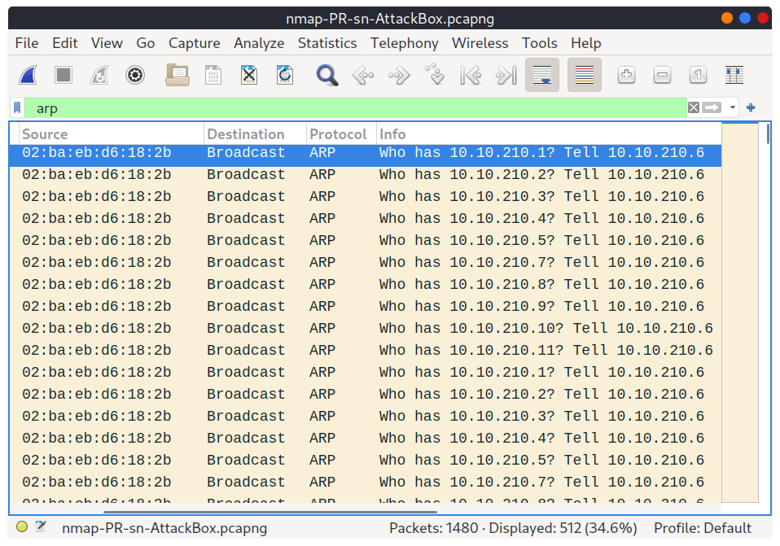

# Nmap Notes 👁️

- Created by _Gordon Lyon_ (Fyodor), a network security expert and open source programmer. It was _released in 1997_
- **Network Mapper** is free, open-source software released under GPL license.
- An industry-standard tool for _mapping networks_, identifying _live hosts_, and discovering _running services_.
- Nmap’s scripting engine can further extend its functionality, from fingerprinting services to exploiting vulnerabilities.
- A Nmap scan usually goes through the steps shown in the figure below, although many are optional and depend on the command-line arguments you provide:
  
- We want to discover more information about a group of hosts or about a subnet. If you are connected to the <u>same subnet</u>, you would expect your <mark>scanner to rely on ARP (Address Resolution Protocol) queries</mark> to discover live hosts. <mark>An ARP query aims to get the hardware address (MAC address)</mark> so that communication over the link-layer becomes possible. however, we can use this to infer that the host is online.
- If you are in `Network A`, you can use ARP <mark>only to discover the devices within that subnet</mark>. Suppose you are connected to a subnet different from the subnet of the target system(s). In that case, all packets generated by your scanner will be routed via the default gateway (router) to reach the systems on another subnet. however, the ARP queries won’t be routed and hence cannot cross the subnet router.
- ARP is a link-layer protocol, and ARP packets are bound to their subnet.

## Enumerating Targets

- We need to specify the targets we want to scan. Generally speaking, you can provide a list, a range, or a subnet. Examples of target specification are:
  - list: `MACHINE_IP scanme.nmap.org example.com` will scan 3 IP addresses.
  - range: `10.11.12.15-20` will scan 6 IP addresses: 10.11.12.15, 10.11.12.16,… and 10.11.12.20.
  - subnet: `MACHINE_IP/30` will scan 4 IP addresses.
- You can also provide a file as input for your list of targets, `nmap -iL list_of_hosts.txt`.
- If you want to check the list of hosts that Nmap will scan, you can use `nmap -sL TARGETS`. This option will give you a detailed list of the hosts that Nmap will scan without scanning them; however, Nmap will attempt a **reverse-DNS resolution** on all the targets to obtain their names. Names might reveal various information to the pentester. (If you don’t want Nmap to the DNS server, you can add `-n`.)

## Discovering Live Hosts

Nmap discovers live hosts using a variety of techniques including **ICMP (ping)** sweeps, **ARP scans**, and **TCP/UDP port scanning**. These methods allow Nmap to identify active systems on a network by sending different types of packets and observing the responses.

- **ICMP (Ping) Sweeps:** Nmap sends ICMP echo request packets (ping) to target IP addresses. If a host responds with an ICMP echo reply, it's considered live. This is a common method, but it can be blocked by firewalls.
- **ARP Scans:** If Nmap is on the same subnet as the target, it can use ARP requests to discover hosts. ARP scans are faster than ICMP for local networks.
- **TCP/UDP Port Scanning:** Nmap sends TCP SYN or ACK packets, or UDP packets to various ports on the target. If a host responds to these packets, it indicates the port is open and the host is likely active.
- **List Scan:** Nmap can perform a list scan which doesn't send any packets to the target but attempts to resolve hostnames via reverse DNS lookups.
- In addition to these, Nmap can use other techniques:
  - **TCP ACK and SYN Scans:** Used to identify hosts by sending TCP packets with ACK or SYN flags, respectively.
  - **ICMP Timestamp and Address Mask Requests:** Used to identify hosts by sending ICMP timestamp or address mask requests.

## Nmap Host Discovery Using ARP

- There are various ways to discover online hosts. When no host discovery options are provided, Nmap follows the following approaches to discover live hosts:
  1. When a privileged user tries to scan targets on a local network (Ethernet), Nmap uses _ARP requests_. A privileged user is root or a user who belongs to sudoers and can run `sudo`.
  2. When a privileged user tries to scan targets outside the local network, Nmap uses _ICMP echo requests_, _TCP ACK (Acknowledge) to port 80_, _TCP SYN (Synchronize) to port 443_, and _ICMP timestamp request_.
  3. When an unprivileged user tries to scan targets outside the local network, Nmap resorts to a _TCP 3-way handshake_ by sending SYN packets to ports 80 and 443.
- <mark>Nmap, by default, uses a ping scan to find live hosts</mark>, then proceeds to scan live hosts only. If you want to use Nmap to discover online hosts without port-scanning the live systems, you can issue `nmap -sn TARGETS`.
- <mark>ARP scan is possible only if you are on the same subnet as the target systems</mark>.
- On an Ethernet (802.3) and WiFi (802.11), **you need to know the MAC address of any system before you can communicate with it**.
- The MAC address is necessary for the link-layer header; the header contains the _source MAC address_ and the _destination MAC address_ among other fields. To get the MAC address, the OS sends an _ARP query_. **A host that replies to ARP queries is up**. The ARP query only works if the target is on the same subnet as yourself, i.e., on the same Ethernet/WiFi.
- You should expect to see many ARP queries generated during a Nmap scan of a local network. If you want Nmap only to perform an ARP scan _without port-scanning_, you can use `nmap -PR -sn TARGETS`, where -PR indicates that you only want an ARP scan

- If we look at the packets generated using a tool such as `tcpdump` or `Wireshark`, we will see network traffic similar to the figure below. In the figure below, Wireshark displays the `source MAC address`, `destination MAC address`, `protocol`, and `query related to each ARP request`. The source address is the MAC address of our Machine, while the destination is the **broadcast address as we don’t know the MAC address of the target**. However, we see the target’s IP address, which appears in the Info column. In the figure, we can see that we are requesting the MAC addresses of all the IP addresses on the subnet, starting with `10.10.210.1`. The host with the IP address we are asking about will send an **ARP reply with its MAC address**, and that’s how we will know that it is online.

- Talking about ARP scans, we should mention a scanner built around ARP queries: `arp-scan`; it provides many options to customize your scan. One popular choice is `arp-scan --localnet` or simply `arp-scan -l`. This command will send ARP queries to all valid IP addresses on your local networks. Moreover, if your system has more than one interface and you are interested in discovering the live hosts on one of them, you can specify the interface using `-I`. For instance, `sudo arp-scan -I eth0 -l` will send ARP queries for all valid IP addresses on the eth0 interface.
- Similarly, the command `arp-scan` will generate many ARP queries that we can see using tcpdump, Wireshark, or a similar tool. We can notice that the packet capture for `arp-scan` and `nmap -PR -sn` yield similar traffic patterns.

## To See 🔍

- [arp-scan](https://linux.die.net/man/1/arp-scan) - The ARP scanner (die doc)
- [arp-scan](https://www.royhills.co.uk/wiki/index.php/Arp-scan_Documentation) - The ARP scanner (wiki doc)
- [masscan](https://manpages.ubuntu.com/manpages/lunar/man8/masscan.8.html) - Fast scan of the Internet
