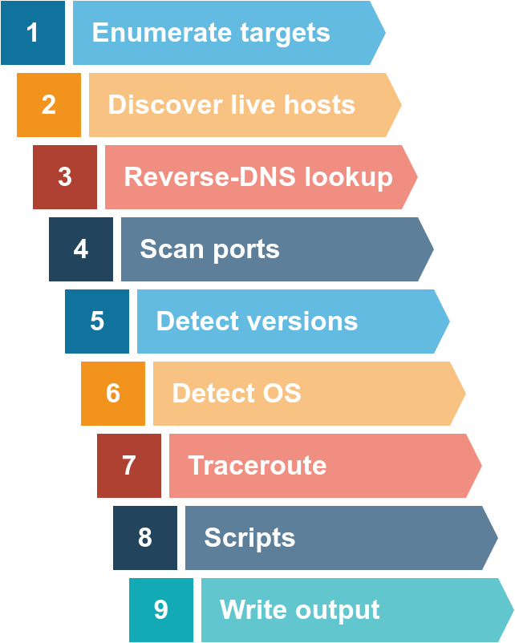

# Nmap Notes 👁️

- Created by _Gordon Lyon_ (Fyodor), a network security expert and open source programmer. It was _released in 1997_
- **Network Mapper** is free, open-source software released under GPL license.
- An industry-standard tool for _mapping networks_, identifying _live hosts_, and discovering _running services_.
- Nmap’s scripting engine can further extend its functionality, from fingerprinting services to exploiting vulnerabilities.
- A Nmap scan usually goes through the steps shown in the figure below, although many are optional and depend on the command-line arguments you provide:
  
- We want to discover more information about a group of hosts or about a subnet. If you are connected to the <u>same subnet</u>, you would expect your <mark>scanner to rely on ARP (Address Resolution Protocol) queries</mark> to discover live hosts. <mark>An ARP query aims to get the hardware address (MAC address)</mark> so that communication over the link-layer becomes possible. however, we can use this to infer that the host is online.
- If you are in `Network A`, you can use ARP <mark>only to discover the devices within that subnet</mark>. Suppose you are connected to a subnet different from the subnet of the target system(s). In that case, all packets generated by your scanner will be routed via the default gateway (router) to reach the systems on another subnet. however, the ARP queries won’t be routed and hence cannot cross the subnet router.
- ARP is a link-layer protocol, and ARP packets are bound to their subnet.

## Enumerating Targets

- We need to specify the targets we want to scan. Generally speaking, you can provide a list, a range, or a subnet. Examples of target specification are:
  - list: `MACHINE_IP scanme.nmap.org example.com` will scan 3 IP addresses.
  - range: `10.11.12.15-20` will scan 6 IP addresses: 10.11.12.15, 10.11.12.16,… and 10.11.12.20.
  - subnet: `MACHINE_IP/30` will scan 4 IP addresses.
- You can also provide a file as input for your list of targets, `nmap -iL list_of_hosts.txt`.
- If you want to check the list of hosts that Nmap will scan, you can use `nmap -sL TARGETS`. This option will give you a detailed list of the hosts that Nmap will scan without scanning them; however, Nmap will attempt a **reverse-DNS resolution** on all the targets to obtain their names. Names might reveal various information to the pentester. (If you don’t want Nmap to the DNS server, you can add `-n`.)

## Discovering Live Hosts

## To See 🔍

- [arp-scan](https://linux.die.net/man/1/arp-scan) - The ARP scanner
- [masscan](https://manpages.ubuntu.com/manpages/lunar/man8/masscan.8.html) - Fast scan of the Internet
