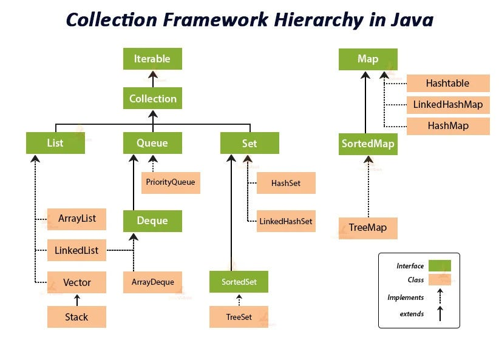

# Java Built In Packages

## Java Lang

The **java.lang** package is a fundamental part of the Java programming language, providing core classes and interfaces essential for basic operations. <mark>It is automatically imported into every Java program</mark>, meaning you don't need to explicitly include it with an import statement.

## Java Utils (java collections framework)

**The Java Collections Framework** is a set of interfaces and classes that provide a unified architecture for representing and manipulating collections. It allows developers to work with groups of objects in an organized and efficient way, reducing development effort and increasing performance.

### Java Collections Framework Hierarchy

- Collections Framework are divided into two basic types: `Collection` and `Map`
- Represented by two interfaces: `java.util.Collection` & `java.util.Map` (Both have several implementing classes)
- import `java.util.*`; to use any of the Collections Framework types

### List interface

- List interface, sub-interface of Collection
  - Defines an ordered group of objects
  - Can contain duplicated objects
- `ArrayList` and `LinkedList` look the same because They share an interface: `List` (An example of polymorphism ("many-forms"))

## Java I/O and Streams

- [Java I/O and Streams](../zip/Input-Output%20and%20Streams%20in%20Java.zip)
  - Introduction to Input/Output Operations
  - Iterators and Streams
  - Custom Methods, Date/Time and Enums
