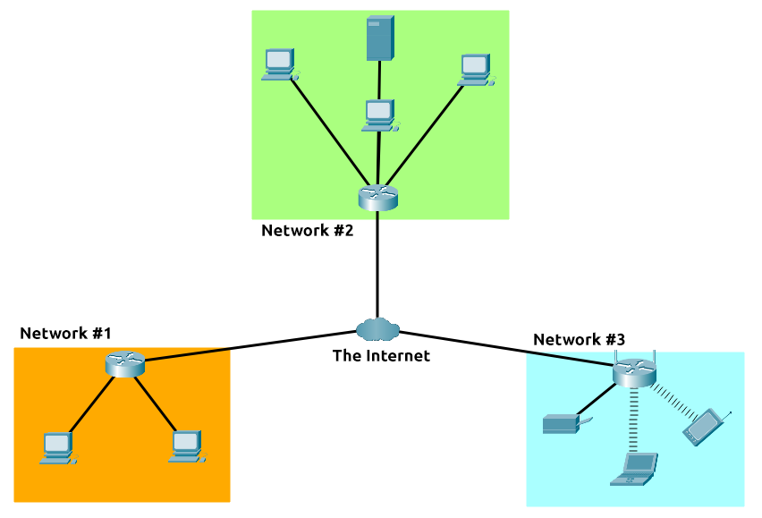
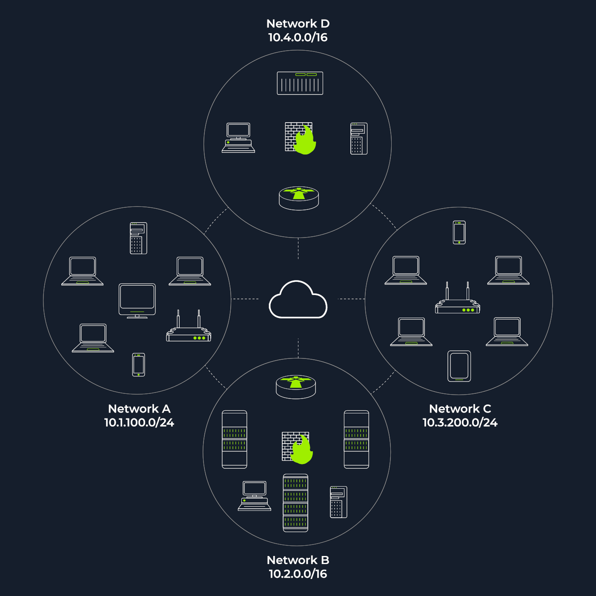
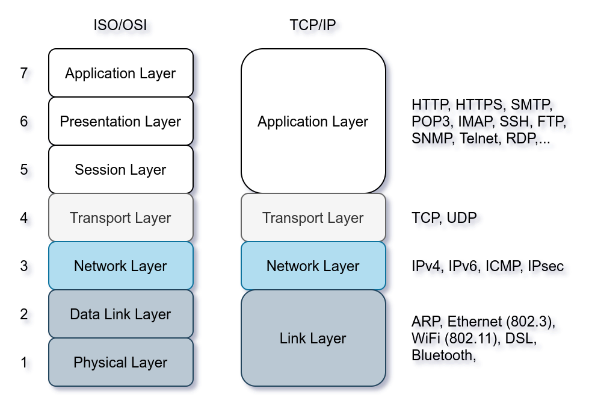

# Notes

- **What is hyperconverged infrastructure (HCI)?** Hyperconverged infrastructure (HCI) is an IT framework that combines compute, networking, and storage on a single platform. This lowers complexity and costs while enabling better scalability, flexibility, and agility in managing and deploying IT resources.
- when you _request a website_, your computer needs to know the server's IP address it needs to talk to; for this, it uses DNS. Your computer then talks to the web server using a special set of commands called the HTTP protocol; the webserver then returns HTML, JavaScript, CSS, Images, etc., which your browser then uses to correctly format and display the website to you.

## Networking



- **Networks** are simply things connected (devices).
- **The internet**, sometimes simply called the _net_, is a worldwide system of interconnected computer networks and electronic devices that communicate with each other using an established set of protocols.
- **The World Wide Web**, often abbreviated as _WWW_ or simply the Web, is a system of interconnected public webpages that are accessed through the internet.
- a network can be one of two types:
  - A private network
  - A public network
- In the following network diagram, we have four network segments or subnetworks. Generally speaking, your system would be connected to one of these network segments/subnetworks. A subnetwork, or simply a subnet, has its own IP address range and is connected to a more extensive network via a router. There might be a firewall enforcing security policies depending on each network.
  
- The figure above shows two types of subnets:
  - Subnets with `/16`, which means that the subnet mask can be written as `255.255.0.0`. This subnet can have around `65 thousand hosts`.
  - Subnets with `/24`, which indicates that the subnet mask can be expressed as `255.255.255.0`. This subnet can have around `250 hosts`.

## What is a DHCP Server?

A DHCP (Dynamic Host Configuration Protocol) server's primary role is to automate the assignment of IP addresses and other network configuration parameters to devices on a network. This eliminates the need for manual configuration of each device, making network administration easier and more efficient, especially in large networks.

## What is a DNS Server?

A DNS (Domain Name System) server's primary role is to translate human-readable domain names (like google.com) into the numerical IP addresses that computers use to locate each other on the internet. It acts like a phonebook for the internet, allowing users to access websites using familiar names instead of complex IP addresses.

## What is a Web Server?

A web server is a software that listens for incoming connections and then utilises the _HTTP protocol_ to deliver web content to its clients. The most common web server software you'll come across is _Apache, Nginx, IIS and NodeJS_. A Web server delivers files from what's called its root directory, which is defined in the software settings. For example, ==Nginx and Apache share the same default location of /var/www/html== in Linux operating systems, and ==IIS uses C:\inetpub\wwwroot for the Windows operating systems==. So, for example, if you requested the file <http://www.example.com/picture.jpg>, it would send the file /var/www/html/picture.jpg from its local hard drive.

## Virtual Hosts

- Web servers can host multiple websites with different domain names; to achieve this, they use virtual hosts. The web server software checks the hostname being requested from the HTTP headers and matches that against its virtual hosts (virtual hosts are just text-based configuration files). If it finds a match, the correct website will be provided. If no match is found, the default website will be provided instead.

- Virtual Hosts can have their root directory mapped to different locations on the hard drive. For example, one.com being mapped to /var/www/website_one, and two.com being mapped to /var/www/website_two

- There's no limit to the number of different websites you can host on a web server.

## Static Vs Dynamic Content

- **Static content**, as the name suggests, is content that never changes. Common examples of this are pictures, javascript, CSS, etc., but can also include HTML that never changes. Furthermore, these are files that are directly served from the webserver with no changes made to them.

- **Dynamic content**, on the other hand, is content that could change with different requests. Take, for example, a blog. On the homepage of the blog, it will show you the latest entries. If a new entry is created, the home page is then updated with the latest entry, or a second example might be a search page on a blog. Depending on what word you search, different results will be displayed.

- These changes to what you end up seeing are done in what is called the _Backend_ with the use of programming and scripting languages. It's called the Backend because what is being done is all done behind the scenes. You can't view the websites' HTML source and see what's happening in the Backend, while the HTML is the result of the processing from the Backend. Everything you see in your browser is called the _Frontend_.

## Scripting and Backend Languages

- There's not much of a limit to what a backend language can achieve, and these are what make a website interactive to the user. Some examples of these languages (in no particular order :p) are PHP, Python, Ruby, NodeJS, Perl and many more. These languages can interact with databases, call external services, process data from the user, and so much more.

- If `index.php` was built like this:

```php
<html><body>Hello <?php echo $_GET["name"]; ?></body></html>
```

It would output the following to the client:

```php
<html><body>Hello adam</body></html>
```

## Logging In via SSH

- **Secure Shell (SSH)** refers to a protocol that allows clients to access and execute commands or actions on remote computers. On Linux-based hosts and servers, as well as other Unix-like operating systems, SSH is one of the permanently installed standard tools and is the preferred choice for many administrators to configure and maintain a computer through remote access. It is an older and very proven protocol that does not require or offer a graphical user interface (GUI). For this reason, it works very efficiently and occupies very few resources
- We can connect to our targets with the following command:

```bash
ZouariOmar@htb[/htb]$ ssh htb-student@[IP address]
```

## VPN

- **VPN (Virtual Private Network)** creates a secure, encrypted tunnel between your computer and a private network.
- It allows you to access internal/private resources that are not accessible over the public internet.
- Private IPs are **not reachable directly** from the internet.
- VPN provides a **private network gateway** to access machines within that network.
- Without VPN, your computer cannot route traffic to private IP addresses.
- Once connected to the VPN, your traffic to private IPs (e.g., `10.129.2.219`) is routed securely through the VPN tunnel.
- This lets you SSH into the target machine as if you were inside the private network.
- VPN also encrypts your traffic, protecting your data from eavesdropping.
- You can use `openvpn` to establish the connection, e.g:

```bash
sudo openvpn --config academy-regular.ovpn
```

## Load Balancers

- When a website's traffic starts getting quite large or is running an application that needs to have high availability, one web server might no longer do the job. Load balancers provide two main features, ensuring high traffic websites can handle the load and providing a failover if a server becomes unresponsive.

- When you request a website with a load balancer, the load balancer will ==receive your request first and then forward it to one of the multiple servers behind it==. The load balancer uses different algorithms to help it decide which server is best to deal with the request. A couple of examples of these algorithms are _round-robin_, which sends it to each server in turn, or weighted, which checks how many requests a server is currently dealing with and sends it to the least busy server.

- Load balancers also perform ==periodic checks with each server to ensure they are running correctly==; this is called a _health check_. If a server doesn't respond appropriately or doesn't respond, the load balancer will stop sending traffic until it responds appropriately again.

## CDN (Content Delivery Networks)

A CDN can be an excellent resource for cutting down traffic to a busy website. It allows you to host static files from your website, such as JavaScript, CSS, Images, Videos, and host them across thousands of servers all over the world. When a user requests one of the hosted files, the CDN works out where the nearest server is physically located and sends the request there instead of potentially the other side of the world.

## Databases

Often websites will need a way of storing information for their users. Webservers can communicate with databases to store and recall data from them. Databases can range from just a simple plain text file up to complex clusters of multiple servers providing speed and resilience. You'll come across some common databases: MySQL, MSSQL, MongoDB, Postgres, and more; each has its specific features.

## WAF (Web Application Firewall)

A WAF sits between your web request and the web server; its primary purpose is to protect the webserver from hacking or denial of service attacks. It analyses the web requests for common attack techniques, whether the request is from a real browser rather than a bot. It also checks if an excessive amount of web requests are being sent by utilising something called rate limiting, which will only allow a certain amount of requests from an IP per second. If a request is deemed a potential attack, it will be dropped and never sent to the webserver.

## Network segment

- A network segment is a group of computers connected using a _shared medium_.
- The medium can be the Ethernet _switch_ or _WiFi access point_.
- In an IP network, a **subnetwork** is usually the equivalent of one or more network segments connected together and configured to _use the same router_.
- The network segment refers to a _physical connection_, while a subnetwork refers to a _logical connection_.

## TCP/IP Model



> ARP from Link Layer </br>
> ICMP from Network Layer </br>
> TCP from Transport Layer </br>
> UDP from Transport Layer </br>

- ARP has one purpose: sending a frame to the broadcast address on the network segment and asking the computer with a specific IP address to respond by providing its MAC (hardware) address.
- ICMP has [many types](https://www.iana.org/assignments/icmp-parameters/icmp-parameters.xhtml). ICMP ping uses Type 8 (Echo) and Type 0 (Echo Reply).
- If you want to ping a system on the same subnet, an ARP query should precede the ICMP Echo.
- Although TCP and UDP are transport layers, for network scanning purposes, a scanner can send a specially-crafted packet to common TCP or UDP ports to check whether the target will respond. This method is efficient, especially when ICMP Echo is blocked.
