# Model Context Protocol (MCP) Notes

## What is the Model Context Protocol (MCP)?

- **MCP (Model Context Protocol)** is an open-source standard for connecting AI applications to external systems.
- Using MCP, AI applications like Claude or ChatGPT can connect to data sources (e.g. local files, databases), tools (e.g. search engines, calculators) and workflows (e.g. specialized prompts)—enabling them to access key information and perform tasks.
- Think of MCP like a USB-C port for AI applications. Just as USB-C provides a standardized way to connect electronic devices, MCP provides a standardized way to connect AI applications to external systems.

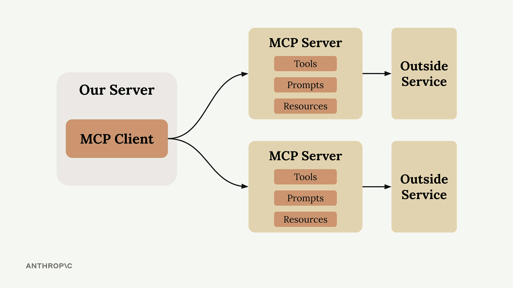

> [!NOTE]
> MCP servers = tool schemas + functions that already defined for you.
> So if you wanna to directly call API, you'll be **authoring** those on your own!

## What can MCP enable?

- Agents can access your Google Calendar and Notion, acting as a more personalized AI assistant.
- AI model Code can generate an entire web app using a Figma design.
- Enterprise chatbots can connect to multiple databases across an organization, empowering users to analyze data using chat.
- AI models can create 3D designs on Blender and print them out using a 3D printer.

## Why does MCP matter?

Depending on where you sit in the ecosystem, MCP can have a range of benefits:

- Developers: MCP reduces development time and complexity when building, or integrating with, an AI application or agent.
- AI applications or agents: MCP provides access to an ecosystem of data sources, tools and apps which will enhance capabilities and improve the end-user experience.
- End-users: MCP results in more capable AI applications or agents which can access your data and take actions on your behalf when necessary.

## How MCP Works

- MCP shifts this burden (writing, testing, and maintaining code) by moving tool definitions and execution from your server to dedicated MCP servers.
- So your application connects to this MCP server **instead of implementing everything from scratch**.

## Transport Agnostic Communication

- One of MCP's key strengths is being transport agnostic - a fancy way of saying the client and server can communicate over different protocols depending on your setup.
  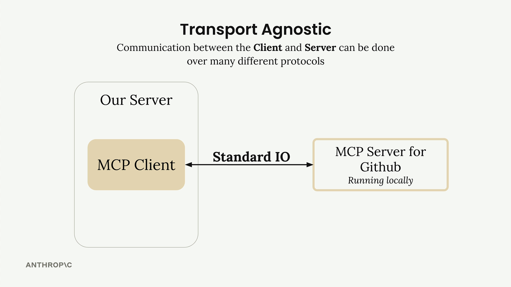

- The most common setup runs both the MCP client and server on the same machine, communicating through standard input/output. But you can also connect them over:
  - HTTP
  - WebSockets
  - Various other network protocols..
    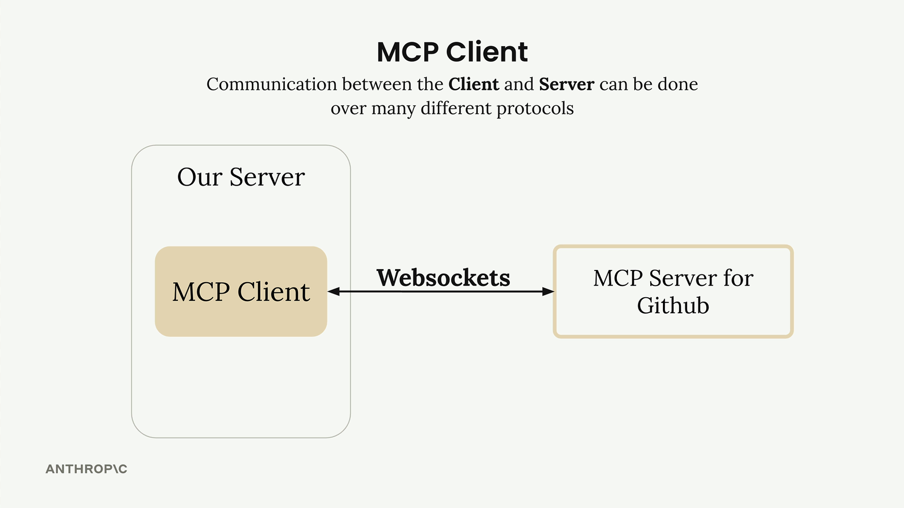

## MCP Message Types

Once connected, the client and server exchange specific message types defined in the MCP specification. The main ones are:

- **ListToolsRequest/ListToolsResult**: The client asks the server "what tools do you provide?" and gets back a list of available tools.
- **CallToolRequest/CallToolResult**: The client asks the server to run a specific tool with given arguments, then receives the results.

## How It All Works Together

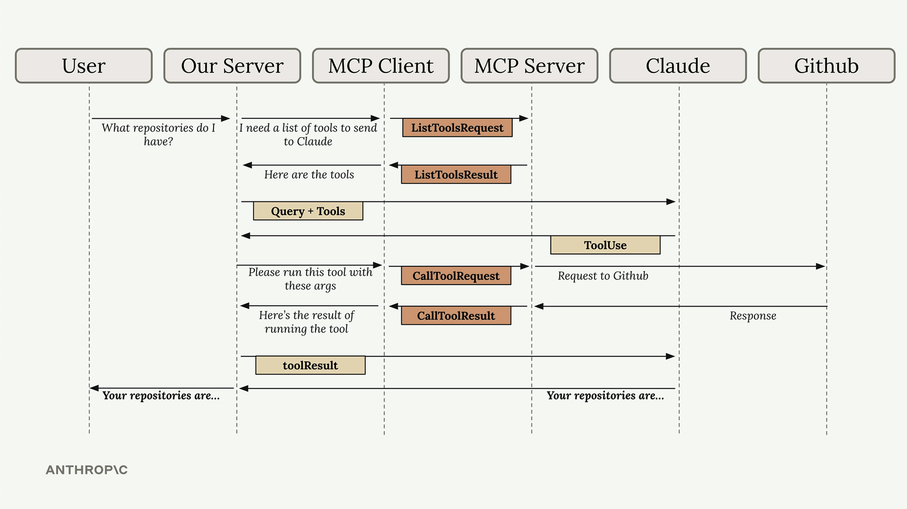

## Hands-on with MCP servers

- Building an MCP server becomes much simpler when you use the official [Python SDK](https://github.com/modelcontextprotocol/python-sdk). Instead of writing complex JSON schemas by hand, you can define tools with decorators and let the SDK handle the heavy lifting.

### Setting Up the MCP Server

The Python MCP SDK makes server creation straightforward. You can initialize a server with just one line:

```python
from mcp.server.fastmcp import FastMCP
mcp = FastMCP("DocumentMCP", log_level="ERROR")
```

### Tool Definition with Decorators

The SDK uses decorators to define tools. Instead of writing JSON schemas manually, you can use Python type hints and field descriptions. The SDK automatically generates the proper schema that model can understand.

### Creating a Document Reader Tool

```python
@mcp.tool(
    name="read_doc_contents",
    description="Read the contents of a document and return it as a string."
)
def read_document(
    doc_id: str = Field(description="Id of the document to read")
):
    if doc_id not in docs:
        raise ValueError(f"Doc with id {doc_id} not found")

    return docs[doc_id]
```

The decorator specifies the tool name and description, while the function parameters define the required arguments. The Field class from Pydantic provides argument descriptions that help model understand what each parameter expects.

### Building a Document Editor Tool

```python
@mcp.tool(
    name="edit_document",
    description="Edit a document by replacing a string in the documents content with a new string."
)
def edit_document(
    doc_id: str = Field(description="Id of the document that will be edited"),
    old_str: str = Field(description="The text to replace. Must match exactly, including whitespace."),
    new_str: str = Field(description="The new text to insert in place of the old text.")
):
    if doc_id not in docs:
        raise ValueError(f"Doc with id {doc_id} not found")

    docs[doc_id] = docs[doc_id].replace(old_str, new_str)
```

This tool takes three parameters: the document ID, the text to find, and the replacement text. The implementation includes error handling for missing documents and performs a straightforward string replacement.

## Python MCP SDK

### Key Benefits of the SDK Approach

- No manual JSON schema writing required
- Type hints provide automatic validation
- Clear parameter descriptions help the ai model understand tool usage
- Error handling integrates naturally with Python exceptions
- Tool registration happens automatically through decorators

### The server inspector

- When building MCP servers, you need a way to test your functionality without connecting to a full application.
- The Python MCP SDK includes a built-in browser-based inspector that lets you debug and test your server in real-time.

#### Starting the Inspector

```bash
mcp dev mcp_server.py
```

This starts a development server and gives you a local URL, typically something like <http://127.0.0.1:6274>. Open this URL in your browser to access the MCP Inspector.

#### Using the Inspector Interface

- The inspector interface is actively being developed, so it may look different when you use it.
- However, the core functionality remains consistent. Look for these key elements:
  - A **Connect** button to start your MCP server
  - Navigation tabs for **Resources**, **Tools**, **Prompts**, and other features
  - A tools listing and testing panel
- Click the **Connect** button first to initialize your server. You'll see the connection status change from "Disconnected" to "Connected".

#### Testing Your Tools

Navigate to the Tools section and click "List Tools" to see all available tools from your server. When you select a tool, the right panel shows its details and input fields.

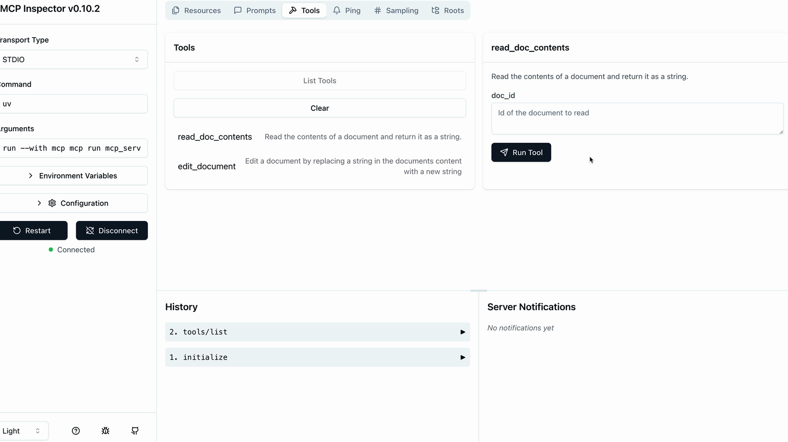

#### Testing Tool Interactions

- You can test multiple tools in sequence to verify complex workflows.
- For instance, after using an edit tool to modify a document, immediately test the read tool to confirm the changes were applied correctly.
- The inspector maintains your server state between tool calls, so edits persist and you can verify the complete functionality of your MCP server.

#### Development Workflow

The MCP Inspector becomes an essential part of your development process. Instead of writing separate test scripts or connecting to full applications, you can:

- Quickly iterate on tool implementations
- Test edge cases and error conditions
- Verify tool interactions and state management
- Debug issues in real-time

> [!NOTE]
> This immediate feedback loop makes MCP server development much more efficient
> and helps catch issues early in the development process.

## Connecting with MCP clients

### Implementing a client

- The client is what allows our application code to communicate with the MCP server and access its functionality.

> [!IMPORTANT]
> In most real-world projects, you'll either implement an MCP client or an MCP server - not both.

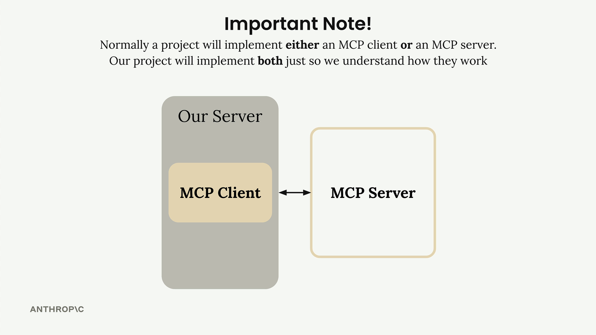

- The MCP client consists of two main components:
  - **MCP Client** - A custom class we create to make using the session easier
  - **Client Session** - The actual connection to the server (part of the MCP Python SDK)

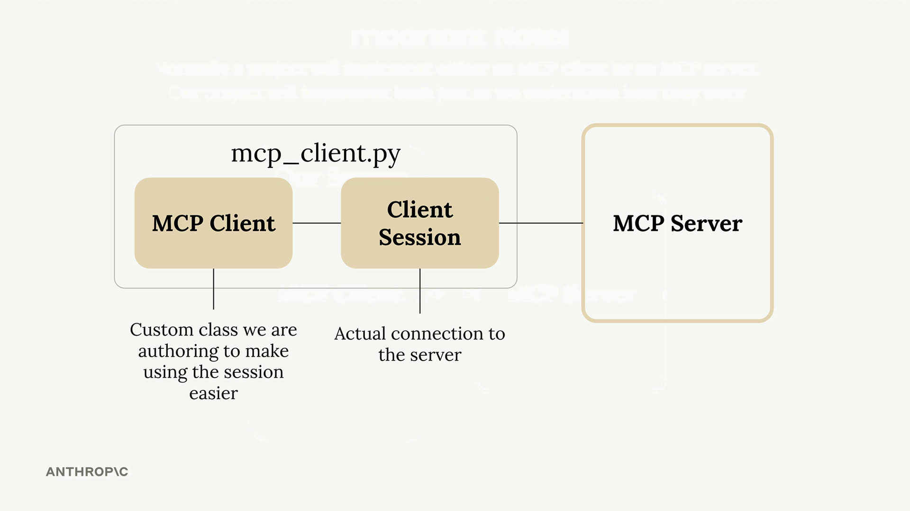

> [!IMPORTANT]
> The client session requires careful resource management - we need to properly clean up connections when we're done.

#### Implementing Core Client Functions

We need to implement two essential functions: `list_tools()` and `call_tool()`.

##### List Tools Function

This function gets all available tools from the MCP server:

```python
async def list_tools(self) -> list[types.Tool]:
    result = await self.session().list_tools()
    return result.tools
```

It's straightforward - we access our session (the connection to the server), call the built-in list_tools() method, and return the tools from the result.

##### Call Tool Function

This function executes a specific tool on the server:

```python
async def call_tool(
    self, tool_name: str, tool_input: dict
) -> types.CallToolResult | None:
    return await self.session().call_tool(tool_name, tool_input)
```

We pass the tool name and input parameters (provided by model) to the server and return the result.

> [!INFO]
> The client acts as the bridge between your application logic and the MCP server's functionality, making it easy to integrate powerful tools into your AI
> workflows.

### Defining resources

- Resources in MCP servers allow you to expose data to clients, similar to GET request handlers in a typical HTTP server.
- They're perfect for scenarios where you need to **fetch information** rather than perform actions.

#### How Resources Work

- Resources follow a request-response pattern.
- When your client needs data, it sends a **ReadResourceRequest** with a `URI` to identify which resource it wants.
- The MCP server processes this request and returns the data in a **ReadResourceResult**.

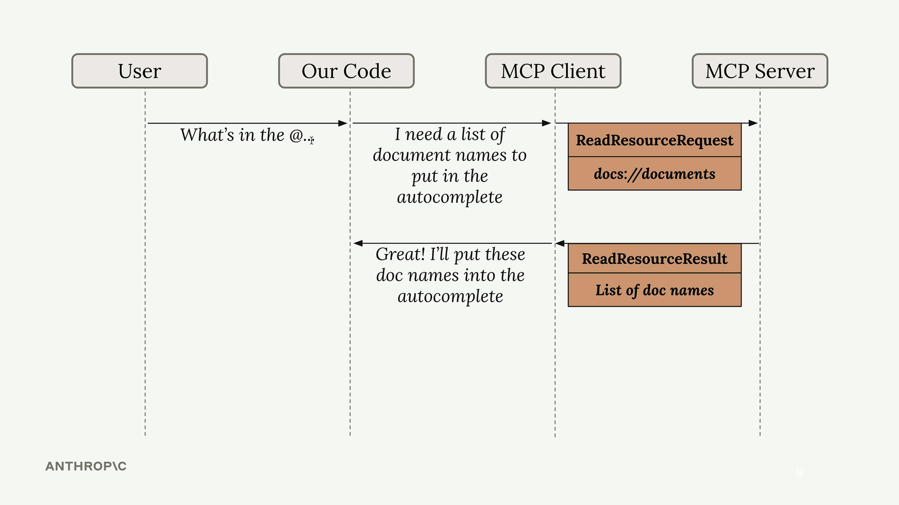

#### Types of Resources

##### Direct Resources

Direct resources have static URIs that never change. They're perfect for operations that don't need parameters.

```python
@mcp.resource(
    "docs://documents",
    mime_type="application/json"
)
def list_docs() -> list[str]:
    return list(docs.keys())
```

##### Templated Resources

Templated resources include parameters in their URIs. The Python SDK automatically parses these parameters and passes them as keyword arguments to your function.

```python
@mcp.resource(
    "docs://documents/{doc_id}",
    mime_type="text/plain"
)
def fetch_doc(doc_id: str) -> str:
    if doc_id not in docs:
        raise ValueError(f"Doc with id {doc_id} not found")
    return docs[doc_id]
```

#### Implementation Details

- Resources can return **any type of data** - strings, JSON, binary data, etc.
- Use the `mime_type` parameter to give clients a hint about what kind of data you're returning:
  - "application/json" for structured data
  - "text/plain" for plain text
  - "application/pdf" for binary files

> [!IMPORTANT]
> The MCP Python SDK automatically serializes your return values. You don't need to manually
> convert objects to JSON strings - just return the data structure and let the SDK handle
> serialization.

> [!NOTE]
> You can test resources using the **MCP Inspector**.

### Accessing resources

- Resources in MCP allow your server to expose information that can be directly included in prompts, rather than requiring tool calls to access data.
- This creates a more efficient way to provide context to AI models.

#### Implementing Resource Reading

To enable resource access in your MCP client, you need to implement a `read_resource` function. First, add the necessary imports:

```python
import json
from pydantic import AnyUrl
```

The core function makes a request to the MCP server and processes the response based on its MIME type:

```python
async def read_resource(self, uri: str) -> Any:
    result = await self.session().read_resource(AnyUrl(uri))
    resource = result.contents[0]

    if isinstance(resource, types.TextResourceContents):
        if resource.mimeType == "application/json":
            return json.loads(resource.text)

    return resource.text
```

#### Understanding the Response Structure

- When you request a resource, the server returns a result with a contents list.
- We access the first element since we typically only need one resource at a time.
- The response includes:
  - The actual content (text or data)
  - A MIME type that tells us how to parse the content
  - Other metadata about the resource

#### Content Type Handling

- The function checks the MIME type to determine how to process the content:
  - If it's `application/json`, parse the text as JSON and return the parsed object
  - Otherwise, return the raw text content
- This approach handles both structured data (like JSON) and plain text documents seamlessly.

### Defining prompts

- Prompts in MCP servers let you define pre-built, high-quality instructions that clients can use instead of writing their own prompts from scratch.
- Think of them as carefully crafted templates that give better results than what users might come up with on their own.

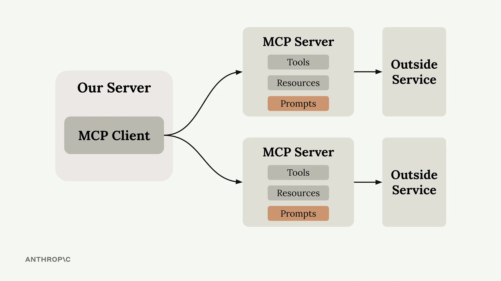

#### Why Use Prompts?

> [!TIP]
> users can already ask AI model to do most tasks directly. For example, a user could type
> "reformat the report.pdf in markdown" and get decent results. But they'll get much better
> results if you provide a thoroughly tested, specialized prompt that handles edge cases and
> follows best practices.

- As the MCP server author, you can spend time crafting, testing, and evaluating prompts that work consistently across different scenarios.
- Users benefit from this expertise without having to become prompt engineering experts themselves.

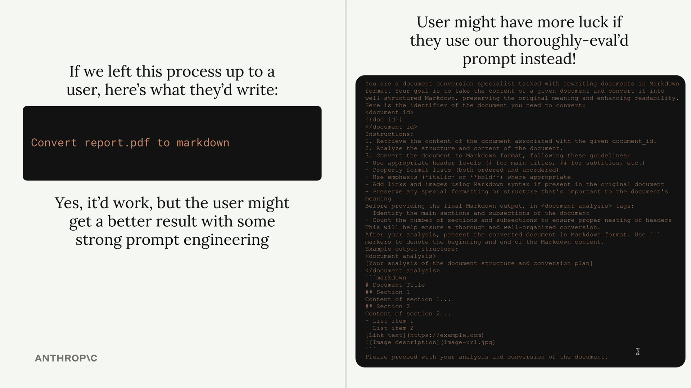

#### Defining Prompts

Prompts use a similar decorator pattern to tools and resources:

```python
@mcp.prompt(
    name="format",
    description="Rewrites the contents of the document in Markdown format."
)
def format_document(
    doc_id: str = Field(description="Id of the document to format")
) -> list[base.Message]:
    prompt = f"""
Your goal is to reformat a document to be written with markdown syntax.

The id of the document you need to reformat is:
<document_id>
{doc_id}
</document_id>

Add in headers, bullet points, tables, etc as necessary. Feel free to add in structure.
Use the 'edit_document' tool to edit the document. After the document has been reformatted...
"""

    return [
        base.UserMessage(prompt)
    ]
```

The function returns a list of messages that get sent directly to AI model. You can include multiple user and assistant messages to create more complex conversation flows.

#### Testing Your Prompts

Use the MCP Inspector to test your prompts before deploying them:
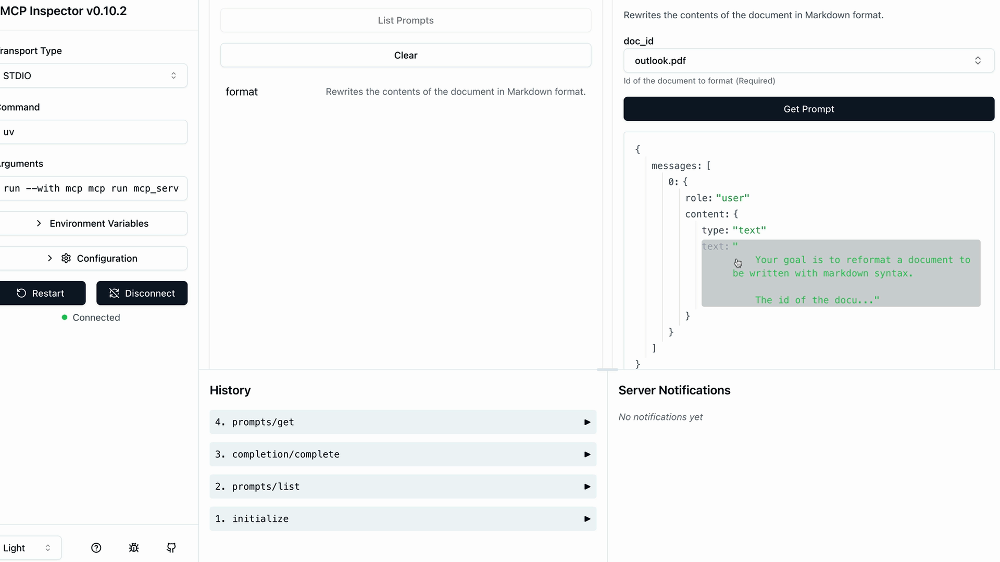

> [!NOTE]
> The inspector shows you exactly what messages will be sent to AI model, including how
> variables get interpolated into your prompt template. This lets you verify the prompt looks
> correct before users start relying on it.

#### Key Benefits

- **Consistency** - Users get reliable results every time
- **Expertise** - You can encode domain knowledge into prompts
- **Reusability** - Multiple client applications can use the same prompts
- **Maintenance** - Update prompts in one place to improve all clients

- Prompts work best when they're specialized for your MCP server's domain.
- A document management server might have prompts for formatting, summarizing, or analyzing documents.
- A data analysis server might have prompts for generating reports or visualizations.

> [!IMPORTANT]
> The goal is to provide prompts that are so well-crafted and tested that users prefer them over
> writing their own instructions from scratch.

### Prompts in the client

#### How Prompts Work

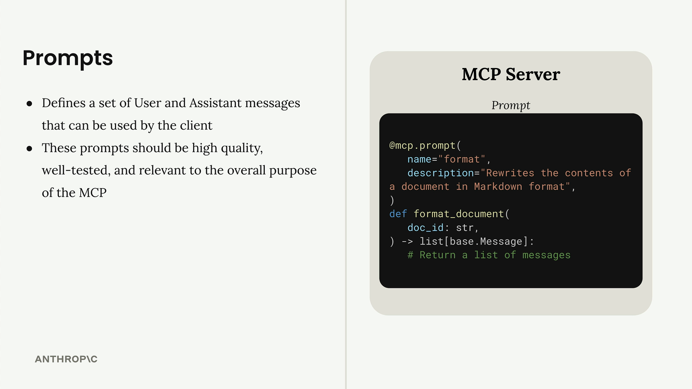

- Prompts define a set of user and assistant messages that clients can use.
- They should be high-quality, well-tested, and relevant to your MCP server's purpose.
- The workflow is:
  - Write and evaluate a prompt relevant to your server's functionality
  - Define the prompt in your MCP server using the `@mcp.prompt` decorator
  - Clients can request the prompt at any time
  - Arguments provided by the client become keyword arguments in your prompt function
  - The function returns formatted messages ready for the AI model
- This system creates reusable, parameterized prompts that maintain consistency while allowing customization through variables.
- It's particularly useful for complex workflows where you want to ensure the AI receives properly structured instructions every time.
