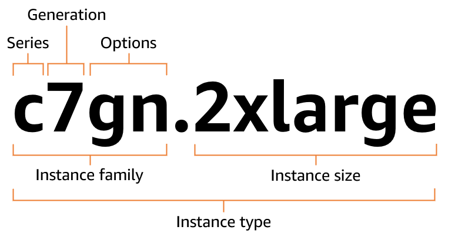
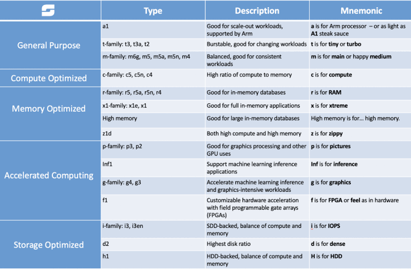
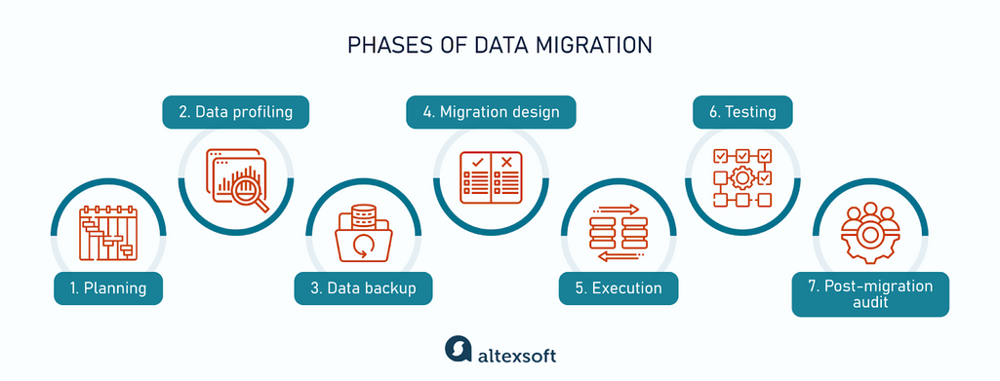
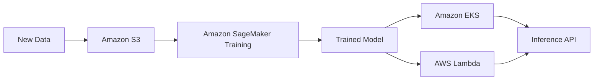
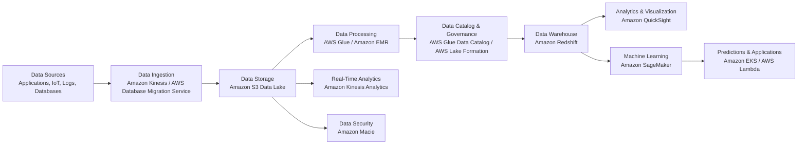
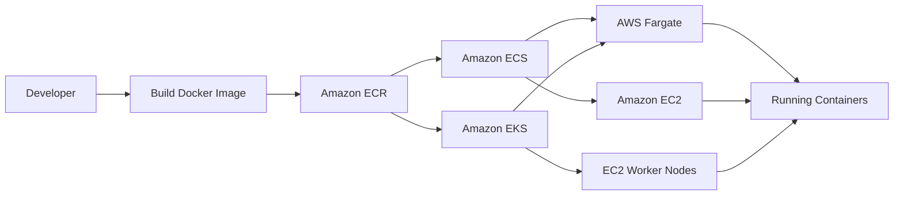

# AWS (Amazone Web Service) Notes

- [AWS (Amazone Web Service) Notes](#aws-amazone-web-service-notes)
  - [The 6 Pillars of AWS](#the-6-pillars-of-aws)
    - [Operational Excellence](#operational-excellence)
    - [Security](#security)
    - [Reliability](#reliability)
    - [Performance Efficiency](#performance-efficiency)
    - [Cost Optimization](#cost-optimization)
    - [Sustainability](#sustainability)
  - [Cloud Adoption Framework (CAF) Perspectives and Foundational Capabilities](#cloud-adoption-framework-caf-perspectives-and-foundational-capabilities)
  - [AWS Cloud services](#aws-cloud-services)
    - [Elastic Compute Cloud (EC2)](#elastic-compute-cloud-ec2)
      - [Why EC2?](#why-ec2)
      - [Naming Conventions](#naming-conventions)
      - [Instance types](#instance-types)
      - [Real-World Use Cases](#real-world-use-cases)
    - [Lambda](#lambda)
      - [Real-World Use Cases](#real-world-use-cases-1)
  - [AWS Databases services](#aws-databases-services)
    - [AWS SQL Services](#aws-sql-services)
      - [Relational Database Service (RDS)](#relational-database-service-rds)
    - [AWS NoSQL Services](#aws-nosql-services)
    - [Memory Database](#memory-database)
    - [Compute Hosted Database (EC2-hosted database)](#compute-hosted-database-ec2-hosted-database)
      - [EC2 vs. Managed Databases (RDS)](#ec2-vs-managed-databases-rds)
  - [AWS Migration and transfer](#aws-migration-and-transfer)
    - [Data Migration Phases](#data-migration-phases)
    - [AWS Snowball](#aws-snowball)
  - [AWS Storage Services](#aws-storage-services)
    - [Quick Selection Guide](#quick-selection-guide)
    - [Storage Types (Architecture)](#storage-types-architecture)
  - [AWS AI/ML Services](#aws-aiml-services)
    - [AWS AI Services](#aws-ai-services)
    - [AWS ML Services](#aws-ml-services)
      - [AWS ML Frameworks](#aws-ml-frameworks)
      - [AWS ML Pipeline](#aws-ml-pipeline)
  - [AWS Data Analytics and BI Services](#aws-data-analytics-and-bi-services)
    - [End-to-End AWS Data Workflow](#end-to-end-aws-data-workflow)
  - [Application Services](#application-services)
    - [Integration Services](#integration-services)
    - [Business Services](#business-services)
  - [Developer Services](#developer-services)
  - [Advanced Intelligent Services](#advanced-intelligent-services)
  - [AWS Container Services](#aws-container-services)
    - [Comparison](#comparison)
    - [Typical Workflow](#typical-workflow)
  - [AWS Networking and content delivery Services](#aws-networking-and-content-delivery-services)
    - [AWS Content Delivery Network (CDN) Services](#aws-content-delivery-network-cdn-services)
      - [CloudFront](#cloudfront)
    - [AWS VPC endpoints](#aws-vpc-endpoints)
  - [AWS Routing Policy](#aws-routing-policy)
    - [Simple routing policy](#simple-routing-policy)
    - [Failover routing policy](#failover-routing-policy)
    - [Geolocation routing policy](#geolocation-routing-policy)
    - [Geoproximity routing policy](#geoproximity-routing-policy)
    - [Latency routing policy](#latency-routing-policy)
    - [IP-based routing policy](#ip-based-routing-policy)
    - [Multivalue answer routing policy](#multivalue-answer-routing-policy)
    - [Weighted routing policy](#weighted-routing-policy)

## The 6 Pillars of AWS

### Operational Excellence

- Run and fix your systems smoothly
- Real-world example: Write your setups as code. This stops human mistakes when building a server

### Security

- Protect your data and systems
- Real-world example: Lock your house doors. Use passwords and give access only to people who need it

### Reliability

- Keep your system working and fix it fast when things break
- Real-world example: Have backup plans. If one server breaks, another server takes over right away

### Performance Efficiency

- Make your system fast and use the right tools
- Real-world example: Pick a small car for short trips and a big truck for heavy loads. Use the right computer power for the job

### Cost Optimization

- Spend money wisely
- Real-world example: Only pay for what you use. Turn off servers at night if you do not need them

### Sustainability

- Think about the planet
- Real-world example: Use less energy by picking server parts that waste less power

## Cloud Adoption Framework (CAF) Perspectives and Foundational Capabilities

- **Business Perspective**: Makes sure cloud projects help your company save money and reach its goals.
- **People Perspective**: Focuses on training your staff and changing your work culture to use the cloud.
- **Governance Perspective**: Sets rules for managing costs, safety, and risks in the cloud.
- **Platform Perspective**: Helps you build a strong, modern foundation for your tech and apps.
- **Security Perspective**: Keeps your cloud data and servers safe from attacks.
- **Operations Perspective**: Focuses on keeping your apps running smoothly every day.

## AWS Cloud services

### Elastic Compute Cloud (EC2)

  

- Amazon EC2 (**E**lastic **C**ompute **C**loud) lets you **rent** virtual servers instead of buying physical computers
- Provides secure, resizable virtual servers (**instances**) in the AWS cloud
- You can launch virtual machines, install any software, and scale capacity up or down in minutes
- You pay only for the exact time your servers run

#### Why EC2?

- **Save Money**: You do not have to buy expensive physical hardware
- **Elasticity**: You can launch one server or thousands in minutes to handle busy days
- **Control**: You have full administrator access to the machine

#### Naming Conventions

  

#### Instance types

  

#### Real-World Use Cases

- Hosting Websites
- App Backends and APIs
- Continuous Testing

### Lambda

  

- A **serverless** compute service
- You upload your code, and it runs automatically in response to triggers
- You do not manage any servers, and you only pay for the exact compute time your code uses

#### Real-World Use Cases

- Automated Media & File Processing
- Serverless Web & Mobile Backends (APIs)
- Real-Time Data Streaming & ETL Pipelines
- Scheduled Automation & Serverless Cron Jobs

## AWS Databases services

### AWS SQL Services

#### Relational Database Service (RDS)

| AWS Service                   | Database Engine               | Primary Use Case                                  | Key Features                                                                                   |
| ----------------------------- | ----------------------------- | ------------------------------------------------- | ---------------------------------------------------------------------------------------------- |
| **Amazon RDS for MySQL**      | MySQL                         | Web applications, CMS, e-commerce                 | Managed MySQL, automated backups, Multi-AZ, read replicas                                      |
| **Amazon RDS for PostgreSQL** | PostgreSQL                    | Enterprise applications, GIS, analytics           | Advanced SQL features, extensions (PostGIS), Multi-AZ, read replicas                           |
| **Amazon RDS for MariaDB**    | MariaDB                       | Open-source web applications                      | MySQL-compatible, managed service, automated patching and backups                              |
| **Amazon RDS for Oracle**     | Oracle Database               | Enterprise ERP, CRM, business applications        | Managed Oracle, BYOL or license included, Multi-AZ, backups                                    |
| **Amazon RDS for SQL Server** | Microsoft SQL Server          | .NET applications, enterprise workloads           | Managed SQL Server, automated maintenance, high availability                                   |
| **Amazon RDS for Db2**        | IBM Db2                       | Enterprise transactional applications             | Managed Db2, automated backups, scaling, high availability                                     |
| **Amazon Aurora**             | MySQL & PostgreSQL Compatible | High-performance cloud-native relational database | Up to 5× MySQL and 3× PostgreSQL performance, distributed storage, automatic scaling, Multi-AZ |

### AWS NoSQL Services

| AWS Service                | NoSQL Type          | Primary Use Case                                           | Key Features                                                                                                |
| -------------------------- | ------------------- | ---------------------------------------------------------- | ----------------------------------------------------------------------------------------------------------- |
| **Amazon DynamoDB**        | Key-value, Document | Serverless applications, gaming, IoT, e-commerce           | Fully managed, single-digit millisecond latency, automatic scaling, Global Tables                           |
| **Amazon MemoryDB**        | In-memory Key-value | Durable, ultra-fast primary database                       | Redis/Valkey compatible, microsecond reads, multi-AZ durability                                             |
| **Amazon ElastiCache**     | In-memory Key-value | Caching, session storage, real-time leaderboards           | Redis/Valkey & Memcached, microsecond latency, managed cache                                                |
| **Amazon DocumentDB**      | Document            | JSON document storage for applications                     | MongoDB-compatible, managed, highly available                                                               |
| **Amazon Keyspaces**       | Wide-column         | Cassandra workloads at scale                               | Apache Cassandra-compatible, serverless, automatic scaling                                                  |
| **Amazon Neptune**         | Graph               | Knowledge graphs, fraud detection, social networks         | Supports Property Graph & RDF models, optimized graph queries                                               |
| **Amazon Timestream**      | Time-series         | IoT telemetry, application monitoring, operational metrics | Serverless, optimized for time-series data, built-in analytics                                              |
| **Amazon QLDB** _(Legacy)_ | Ledger              | Immutable transaction records                              | Cryptographically verifiable ledger (AWS recommends Amazon Aurora PostgreSQL with Ledger for new workloads) |

### Memory Database

| Feature             | Amazon MemoryDB                       | Amazon ElastiCache                    |
| ------------------- | ------------------------------------- | ------------------------------------- |
| **Primary Purpose** | Durable primary database              | Transient data caching                |
| **Read Latency**    | Microseconds                          | Microseconds                          |
| **Write Latency**   | Single-digit milliseconds             | Microseconds                          |
| **Data Durability** | Built-in via multi-AZ transaction log | Ephemeral (data can be lost on reset) |
| **Engines**         | Valkey, Redis OSS                     | Valkey, Redis OSS, Memcached          |

### Compute Hosted Database (EC2-hosted database)

#### EC2 vs. Managed Databases (RDS)

| Feature                       | Database on Amazon EC2                     | Amazon RDS / Aurora                        |
| ----------------------------- | ------------------------------------------ | ------------------------------------------ |
| **Management Responsibility** | Fully self-managed by you.                 | Fully managed by AWS.                      |
| **OS & Root Access**          | Full administrative/root access.           | No operating system access.                |
| **Engine Customization**      | Any database engine, version, or plugin.   | Limited to AWS-supported versions.         |
| **Backups & Patching**        | Manual setup or custom scripts required.   | Automated by AWS.                          |
| **High Availability (HA)**    | Manually configure replication across AZs. | Built-in Multi-AZ failover with one click. |

## AWS Migration and transfer

- AWS offers a wide range of migration tools, guidance, services, and programs
  to help you assess, migrate and modernize applications and data from building
  the business case to leveraging AWS services to deliver new experiences
- Migrate databases to AWS quickly and securely with minimal downtime
- Trusted by customers to securely migrate **1.5M+** databases with minimal downtime and zero data loss

| AWS Migration Service                       | Purpose                                                                                                            | What It Migrates                                                                                                         | Best Used For                                                                                        | Key Features                                                                                                                                  |
| ------------------------------------------- | ------------------------------------------------------------------------------------------------------------------ | ------------------------------------------------------------------------------------------------------------------------ | ---------------------------------------------------------------------------------------------------- | --------------------------------------------------------------------------------------------------------------------------------------------- |
| **AWS Application Discovery Service**       | Discovers and assesses on-premises infrastructure before migration.                                                | Server inventory, application dependencies, performance metrics                                                          | Migration planning and assessment                                                                    | Automatic discovery, dependency mapping, utilization metrics, exports data to AWS Migration Hub                                               |
| **AWS Transform (formerly Transform MGN)**  | Modernizes legacy .NET, Java, and mainframe applications using AI-assisted code transformation.                    | Application source code                                                                                                  | Application modernization and refactoring                                                            | AI-assisted code analysis, automated code transformation, modernization recommendations                                                       |
| **AWS Application Migration Service (MGN)** | Migrates physical, virtual, and cloud servers to AWS with minimal downtime.                                        | Entire servers (OS, applications, configuration)                                                                         | Lift-and-shift (rehost) migrations                                                                   | Continuous block-level replication, non-disruptive testing, automated cutover                                                                 |
| **AWS Database Migration Service (DMS)**    | Migrates databases to AWS securely with minimal downtime.                                                          | Relational and NoSQL databases                                                                                           | Homogeneous and heterogeneous database migrations                                                    | Change Data Capture (CDC), continuous replication, supports Oracle, SQL Server, MySQL, PostgreSQL, MongoDB, etc.                              |
| **AWS Mainframe Modernization**             | Modernizes and migrates legacy mainframe applications to AWS.                                                      | COBOL, PL/I, CICS, IMS applications                                                                                      | Mainframe modernization                                                                              | Automated code conversion, managed runtime, refactoring and replatforming options                                                             |
| **AWS Migration Hub**                       | Central dashboard for tracking migrations across AWS and partner tools.                                            | Migration metadata and progress                                                                                          | Managing large migration projects                                                                    | Single migration dashboard, progress tracking, integrates with MGN, DMS, DataSync, Discovery Service                                          |
| **AWS Snow Family**                         | Transfers massive amounts of data using secure physical devices.                                                   | Files, databases, backups, datasets (TBs to PBs)                                                                         | Offline migrations with limited network bandwidth                                                    | Snowcone, Snowball Edge, Snowmobile, encryption, rugged devices, edge computing                                                               |
| **AWS DataSync**                            | Accelerates online data transfer between on-premises storage and AWS.                                              | Files and objects                                                                                                        | File migration and synchronization                                                                   | High-speed transfer, incremental sync, scheduling, encryption, bandwidth throttling                                                           |
| **AWS Transfer Family**                     | Provides managed file transfer protocols for AWS storage.                                                          | Files via SFTP, FTPS, FTP, AS2                                                                                           | B2B file exchange and legacy file transfer                                                           | Managed SFTP/FTPS/FTP/AS2 endpoints, integrates with Amazon S3 and Amazon EFS, identity provider support                                      |
| **AWS Schema Conversion Tool (AWS SCT)**    | Converts database schemas, SQL code, and application code to support migration between different database engines. | Database schemas, tables, indexes, views, stored procedures, functions, triggers, SQL queries, and some application code | Heterogeneous database migrations (e.g., Oracle → PostgreSQL, SQL Server → Amazon Aurora PostgreSQL) | Automated schema assessment, schema conversion, SQL code conversion, migration assessment reports, integrates with AWS DMS for data migration |

### Data Migration Phases

### AWS Snowball

Accelerate moving offline data or remote storage to the cloud

## AWS Storage Services

| Service                                                | Storage Type                     | Best For                                                                                                           | Durability / Availability                                                                                                          | Key Features                                                                                                                                                                                                                                            |
| ------------------------------------------------------ | -------------------------------- | ------------------------------------------------------------------------------------------------------------------ | ---------------------------------------------------------------------------------------------------------------------------------- | ------------------------------------------------------------------------------------------------------------------------------------------------------------------------------------------------------------------------------------------------------- |
| **Amazon S3**                                          | Active Object Storage            | Backups, static websites, data lakes, media files                                                                  | 99.999999999% (11 9's) durability                                                                                                  | Scalable, versioning, lifecycle policies, encryption, event notifications                                                                                                                                                                               |
| **Amazon S3 Intelligent-Tiering**                      | Intelligent Object Storage       | Data with unknown or changing access patterns                                                                      | 99.999999999% (11 9's) durability                                                                                                  | Automatically moves objects between frequent, infrequent, archive instant, archive, and deep archive access tiers to optimize storage costs without impacting performance; no retrieval fees for frequent/infrequent tiers; automatic cost optimization |
| **Amazon S3 One Zone-Infrequent Access (One Zone-IA)** | Infrequent Access Object Storage | Infrequently accessed data that can be recreated, secondary backups, and non-critical data                         | **99.999999999% (11 9's) durability** within a **single Availability Zone**                                                        | Lower storage cost than S3 Standard-IA, stores data in one Availability Zone, millisecond retrieval, lifecycle policy support, encryption, suitable for non-critical or reproducible data                                                               |
| **Amazon S3 Glacier**                                  | Archive Object Storage           | Long-term data archiving                                                                                           | 11 9's durability                                                                                                                  | Low-cost archival, multiple retrieval options, compliance support                                                                                                                                                                                       |
| **Amazon S3 Glacier Deep Archive**                     | Archive Object Storage           | Long-term archival, compliance records, and data retained for years with rare access                               | **99.999999999% (11 9's) durability**                                                                                              | Lowest-cost S3 storage class, designed for data accessed only a few times per year, retrieval times of 12–48 hours, lifecycle policy support, encryption, compliance and long-term retention                                                            |
| **Amazon S3 on Outposts**                              | On-Premises Object Storage       | Applications requiring local data processing, on-premises workloads, and low-latency access                        | High availability within an **AWS Outposts** deployment                                                                            | Extends Amazon S3 to AWS Outposts, stores data on-premises, supports the S3 API, integrates with AWS services, local data residency, low-latency access, and seamless hybrid cloud management                                                           |
| **Amazon EBS (Elastic Block Store)**                   | Block Storage                    | EC2 instance volumes, databases                                                                                    | High availability within an Availability Zone                                                                                      | SSD/HDD options, snapshots, encryption, resize volumes                                                                                                                                                                                                  |
| **Amazon EFS (Elastic File System)**                   | File Storage                     | Shared Linux workloads, containers                                                                                 | Regional, highly available                                                                                                         | NFS protocol, elastic scaling, shared access across multiple EC2 instances                                                                                                                                                                              |
| **Amazon ElastiCache**                                 | In-Memory Data Store / Cache     | Caching frequently accessed data, session storage, real-time applications, leaderboards, gaming, and microservices | High availability with Multi-AZ (Redis OSS/Valkey); automatic failover; durability depends on engine and persistence configuration | Supports **Redis OSS, Valkey, and Memcached**; sub-millisecond latency; automatic scaling, replication, Multi-AZ deployment, automatic failover, and data persistence (Redis OSS/Valkey); reduces database load and improves application performance    |
| **Amazon FSx**                                         | Managed File Storage             | Windows, Lustre, NetApp ONTAP, OpenZFS workloads                                                                   | High availability (varies by deployment)                                                                                           | Native file systems, high performance, managed infrastructure                                                                                                                                                                                           |
| **AWS Storage Gateway**                                | Hybrid Storage                   | Connect on-premises environments to AWS                                                                            | Depends on backend storage                                                                                                         | File, volume, and tape gateway options for hybrid cloud                                                                                                                                                                                                 |
| **AWS Backup**                                         | Backup Management                | Centralized backup across AWS services                                                                             | Managed service                                                                                                                    | Automated backup policies, compliance, cross-region/account backups                                                                                                                                                                                     |
| **AWS Snow Family**                                    | Data Transfer & Edge Storage     | Large-scale data migration and edge computing                                                                      | Rugged, secure appliances                                                                                                          | Offline data transfer, edge processing, petabyte-scale migration                                                                                                                                                                                        |
| **AWS DataSync**                                       | Data Transfer                    | Fast online data migration                                                                                         | Managed service                                                                                                                    | Automated data synchronization between on-premises and AWS                                                                                                                                                                                              |
| **AWS Transfer Family**                                | Managed File Transfer            | Secure file transfer using SFTP, FTPS, FTP                                                                         | Managed service                                                                                                                    | Integrates with S3 and EFS, supports existing workflows                                                                                                                                                                                                 |

### Quick Selection Guide

| If you need...                              | Use                 |
| ------------------------------------------- | ------------------- |
| Store files, images, videos                 | Amazon S3           |
| Archive data cheaply                        | Amazon S3 Glacier   |
| Disk for an EC2 instance                    | Amazon EBS          |
| Shared file system for Linux                | Amazon EFS          |
| Managed Windows or specialized file systems | Amazon FSx          |
| Hybrid cloud storage                        | AWS Storage Gateway |
| Centralized backups                         | AWS Backup          |
| Transfer petabytes offline                  | AWS Snow Family     |
| Online data migration                       | AWS DataSync        |
| SFTP/FTP server in AWS                      | AWS Transfer Family |

### Storage Types (Architecture)

> How the system is set up?

| Storage Type       | Description                                                                                                             |
| ------------------ | ----------------------------------------------------------------------------------------------------------------------- |
| **Object Storage** | Stores data as unorganized, flat units (objects) with custom metadata (tags) attached to each object.                   |
| **File Storage**   | Organizes data into files and folders using a hierarchical directory structure, similar to a standard desktop computer. |
| **Block Storage**  | Splits large data into fixed-size blocks. Each block has its own unique address and can be managed independently.       |
| **Cache Storage**  | Stores frequently accessed data in high-speed memory to reduce latency and improve application performance.             |

## AWS AI/ML Services

### AWS AI Services

| Service            | Purpose                                                             | Common Use Cases                                                                                  |
| ------------------ | ------------------------------------------------------------------- | ------------------------------------------------------------------------------------------------- |
| Amazon Rekognition | Image and video analysis                                            | Face detection, object recognition, content moderation                                            |
| Amazon Comprehend  | Natural language processing (NLP)                                   | Sentiment analysis, entity extraction, document classification                                    |
| Amazon Lex         | Conversational AI and chatbots                                      | Customer support bots, virtual assistants                                                         |
| Amazon Polly       | Text-to-speech                                                      | Voice assistants, accessibility, audio content                                                    |
| Amazon Translate   | Neural machine translation                                          | Website localization, multilingual applications                                                   |
| Amazon Forecast    | Time-series forecasting                                             | Demand forecasting, inventory planning                                                            |
| Amazon CodeGuru    | AI-powered code reviews and application performance recommendations | Automated code reviews, security issue detection, performance optimization, application profiling |

### AWS ML Services

| Service                                                 | Purpose                                                                             | Common Use Cases                                                                                |
| ------------------------------------------------------- | ----------------------------------------------------------------------------------- | ----------------------------------------------------------------------------------------------- |
| Amazon SageMaker AI                                     | Build, train, and deploy machine learning models at scale                           | Custom ML models, AutoML, MLOps, model training, deployment, and monitoring                     |
| Amazon CodeWhisperer _(now part of Amazon Q Developer)_ | AI-powered coding companion that uses machine learning to generate code suggestions | Code completion, code generation, unit test creation, security scanning, developer productivity |

#### AWS ML Frameworks

| Framework                 | Description                                                                  | Common Use Cases                                                       |
| ------------------------- | ---------------------------------------------------------------------------- | ---------------------------------------------------------------------- |
| TensorFlow                | Open-source deep learning framework supported by AWS                         | Image recognition, NLP, recommendation systems                         |
| PyTorch                   | Open-source machine learning framework optimized for research and production | Computer vision, generative AI, deep learning                          |
| Apache MXNet              | Scalable deep learning framework with AWS support                            | Distributed training, computer vision, NLP                             |
| Scikit-learn              | Python library for traditional machine learning                              | Classification, regression, clustering, predictive analytics           |
| XGBoost                   | High-performance gradient boosting framework                                 | Fraud detection, customer churn prediction, tabular data modeling      |
| Hugging Face Transformers | Library for pre-trained transformer models                                   | Large language models (LLMs), NLP, text generation, question answering |

#### AWS ML Pipeline

## AWS Data Analytics and BI Services

| Service           | Purpose                                                    | Common Use Cases                                                                             |
| ----------------- | ---------------------------------------------------------- | -------------------------------------------------------------------------------------------- |
| Amazon Athena     | Query data in Amazon S3 using SQL without managing servers | Ad hoc analysis, log analysis, data exploration                                              |
| Amazon Kinesis    | Real-time data streaming and processing                    | IoT data, clickstream analytics, real-time dashboards                                        |
| Amazon Redshift   | Fully managed cloud data warehouse                         | Business intelligence, data warehousing, analytics                                           |
| AWS Glue          | Serverless data integration and ETL service                | Data preparation, ETL pipelines, data cataloging                                             |
| Amazon QuickSight | Cloud-native business intelligence (BI) service            | Dashboards, data visualization, business reporting                                           |
| Amazon Macie      | Data security and privacy service using machine learning   | Discover and protect sensitive data in Amazon S3, data classification, compliance monitoring |

### End-to-End AWS Data Workflow

## Application Services

### Integration Services

| Service                                  | Purpose                                                       | Common Use Cases                                                                            |
| ---------------------------------------- | ------------------------------------------------------------- | ------------------------------------------------------------------------------------------- |
| Amazon EventBridge                       | Serverless event bus for connecting applications using events | Event-driven architectures, SaaS integrations, application automation, serverless workflows |
| Amazon SQS (Simple Queue Service)        | Fully managed message queuing service                         | Decoupling applications, asynchronous processing, workload buffering                        |
| Amazon SNS (Simple Notification Service) | Fully managed pub/sub messaging service                       | Notifications, fan-out messaging, alerts, mobile and email messaging                        |

### Business Services

| Service                           | Purpose                                                      | Common Use Cases                                                                        |
| --------------------------------- | ------------------------------------------------------------ | --------------------------------------------------------------------------------------- |
| AWS Business Applications         | Cloud-based business application solutions for organizations | Business process automation, enterprise workflows, customer engagement                  |
| Amazon Connect                    | Cloud-based contact center service                           | Customer support, call centers, voice/chat interactions, customer experience management |
| Amazon SES (Simple Email Service) | Scalable email sending and receiving service                 | Transactional emails, marketing emails, notifications, email campaigns                  |

## Developer Services

| Service          | Purpose                                                                      | Common Use Cases                                                 |
| ---------------- | ---------------------------------------------------------------------------- | ---------------------------------------------------------------- |
| AWS CodePipeline | Fully managed continuous integration and continuous delivery (CI/CD) service | Automate build, test, and deployment workflows                   |
| AWS CodeCommit   | Managed source control service based on Git                                  | Store, manage, and collaborate on application source code        |
| AWS CodeBuild    | Fully managed build service                                                  | Compile code, run tests, and produce deployment artifacts        |
| AWS CodeDeploy   | Automated software deployment service                                        | Deploy applications to EC2, Lambda, ECS, and on-premises servers |
| AWS CodeArtifact | Managed artifact repository service                                          | Store and share software packages and dependencies               |
| AWS Cloud9       | Cloud-based integrated development environment (IDE)                         | Write, run, and debug code in the cloud                          |

## Advanced Intelligent Services

| Service       | Purpose                                                                  | Common Use Cases                                                                       |
| ------------- | ------------------------------------------------------------------------ | -------------------------------------------------------------------------------------- |
| AWS IoT Core  | Managed cloud service that connects IoT devices to AWS services securely | Device communication, IoT data collection, smart devices, industrial IoT               |
| Amazon Braket | Fully managed quantum computing service                                  | Quantum algorithm development, quantum research, hybrid quantum-classical applications |

## AWS Container Services

| Service                                     | Description                                                                                                                | Primary Use Case                                                                 | Key Features                                                                                                                                     | Best For                                                                                     | Server Management                | Orchestration        |
| ------------------------------------------- | -------------------------------------------------------------------------------------------------------------------------- | -------------------------------------------------------------------------------- | ------------------------------------------------------------------------------------------------------------------------------------------------ | -------------------------------------------------------------------------------------------- | -------------------------------- | -------------------- |
| **Amazon Elastic Container Service (ECS)**  | A fully managed container orchestration service that simplifies deploying, managing, and scaling Docker containers on AWS. | Running containerized applications with AWS-native orchestration.                | - Fully managed service - Deep AWS integration - Supports EC2 and Fargate launch types - Auto scaling - Load balancing integration   | Organizations wanting a simple, AWS-native container platform without Kubernetes complexity. | Optional (EC2) or None (Fargate) | Amazon ECS           |
| **Amazon Elastic Kubernetes Service (EKS)** | A managed Kubernetes service that makes it easy to run Kubernetes clusters on AWS and on-premises.                         | Running Kubernetes-based applications across hybrid or multi-cloud environments. | - Certified Kubernetes - Managed control plane - Supports EC2 and Fargate - High availability - Compatible with Kubernetes ecosystem | Teams already using Kubernetes or requiring portability across environments.                 | Optional (EC2) or None (Fargate) | Kubernetes           |
| **Amazon Elastic Container Registry (ECR)** | A fully managed container image registry for storing, managing, and deploying Docker and OCI container images securely.    | Storing and managing container images for deployment.                            | - Private & public repositories - Image vulnerability scanning - IAM integration - Lifecycle policies - Image encryption             | Secure container image storage integrated with AWS services.                                 | N/A                              | Image Registry       |
| **AWS Fargate**                             | A serverless compute engine for containers that eliminates the need to provision and manage servers.                       | Running containers without managing infrastructure.                              | - Serverless containers - Automatic scaling - Pay only for resources used - Supports ECS and EKS - Built-in security isolation       | Developers who want to focus on applications instead of infrastructure management.           | None                             | Works with ECS & EKS |

### Comparison

| Feature                   | ECS                     | EKS                | ECR                | Fargate            |
| ------------------------- | ----------------------- | ------------------ | ------------------ | ------------------ |
| Service Type              | Container Orchestration | Kubernetes Service | Container Registry | Serverless Compute |
| Runs Containers           | Yes                     | Yes                | No                 | Yes                |
| Stores Container Images   | No                      | No                 | Yes                | No                 |
| Uses Kubernetes           | No                      | Yes                | N/A                | Optional (via EKS) |
| AWS Native                | Yes                     | Yes                | Yes                | Yes                |
| Serverless Option         | Via Fargate             | Via Fargate        | N/A                | Native             |
| Supports Docker Images    | Yes                     | Yes                | Yes                | Yes                |
| Infrastructure Management | Low                     | Medium             | None               | None               |

### Typical Workflow

## AWS Networking and content delivery Services

| Service                            | Category                       | Primary Purpose                                                                                 |
| ---------------------------------- | ------------------------------ | ----------------------------------------------------------------------------------------------- |
| Amazon API Gateway                 | API Management                 | Create, publish, secure, monitor, and manage APIs at any scale.                                 |
| AWS App Mesh                       | Service Mesh                   | Manage and monitor communication between microservices.                                         |
| Amazon CloudFront                  | Content Delivery Network (CDN) | Deliver content globally with low latency and high transfer speeds.                             |
| AWS Cloud Map                      | Service Discovery              | Discover and manage cloud resources and services dynamically.                                   |
| AWS Direct Connect                 | Hybrid Connectivity            | Establish a dedicated private network connection between on-premises infrastructure and AWS.    |
| Elastic Load Balancing (ELB)       | Load Balancing                 | Automatically distribute incoming traffic across multiple targets.                              |
| AWS Global Accelerator             | Global Networking              | Improve application availability and performance using the AWS global network.                  |
| Integrated Private Wireless on AWS | Private Wireless               | Deploy and manage private wireless networks integrated with AWS services.                       |
| AWS PrivateLink                    | Private Connectivity           | Securely access AWS services and VPC-hosted applications without using the public internet.     |
| AWS Private 5G                     | Private Cellular Network       | Deploy and operate private 5G mobile networks with AWS-managed infrastructure.                  |
| Amazon Route 53                    | DNS & Traffic Routing          | Scalable DNS, domain registration, health checking, and traffic routing.                        |
| AWS Transit Gateway                | Network Hub                    | Connect multiple VPCs, VPNs, and on-premises networks through a central gateway.                |
| AWS Verified Access                | Zero Trust Access              | Provide secure application access based on identity and device posture without requiring a VPN. |
| Amazon VPC                         | Virtual Networking             | Provision isolated virtual networks for AWS resources.                                          |
| Amazon VPC Lattice                 | Application Networking         | Connect, secure, and monitor communication between services across VPCs and accounts.           |
| Site-to-Site VPN                   | Hybrid Connectivity            | Securely connect on-premises networks to AWS VPCs over encrypted IPsec tunnels.                 |

### AWS Content Delivery Network (CDN) Services

#### CloudFront

  

- It caches copies of your files in hundreds of global server locations.
- When a user loads your page, CloudFront sends the file from the closest location.
- This makes loading times very fast.

> Securely deliver content with low latency and high transfer speeds

### AWS VPC endpoints

- Let your private network resources (like servers) talk to other AWS services securely
- They use **private IP addresses**
- This keeps your data safely inside the Amazon network
- You do not need public internet access or NAT gateways

## AWS Routing Policy

### Simple routing policy

Use for a single resource that performs a given function for your domain, for example, a web server that serves content for the example.com website. You can use simple routing to create records in a private hosted zone.

### Failover routing policy

Use when you want to configure active-passive failover. You can use failover routing to create records in a private hosted zone.

### Geolocation routing policy

Use when you want to route traffic based on the location of your users. You can use geolocation routing to create records in a private hosted zone.

### Geoproximity routing policy

Use when you want to route traffic based on the location of your resources and, optionally, shift traffic from resources in one location to resources in another location. You can use geoproximity routing to create records in a private hosted zone.

### Latency routing policy

Use when you have resources in multiple AWS Regions and you want to route traffic to the Region that provides the best latency. You can use latency routing to create records in a private hosted zone.

### IP-based routing policy

Use when you want to route traffic based on the location of your users, and have the IP addresses that the traffic originates from.

### Multivalue answer routing policy

Use when you want Route 53 to respond to DNS queries with up to eight healthy records selected at random. You can use multivalue answer routing to create records in a private hosted zone.

### Weighted routing policy

Use to route traffic to multiple resources in proportions that you specify. You can use weighted routing to create records in a private hosted zone.
