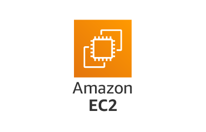
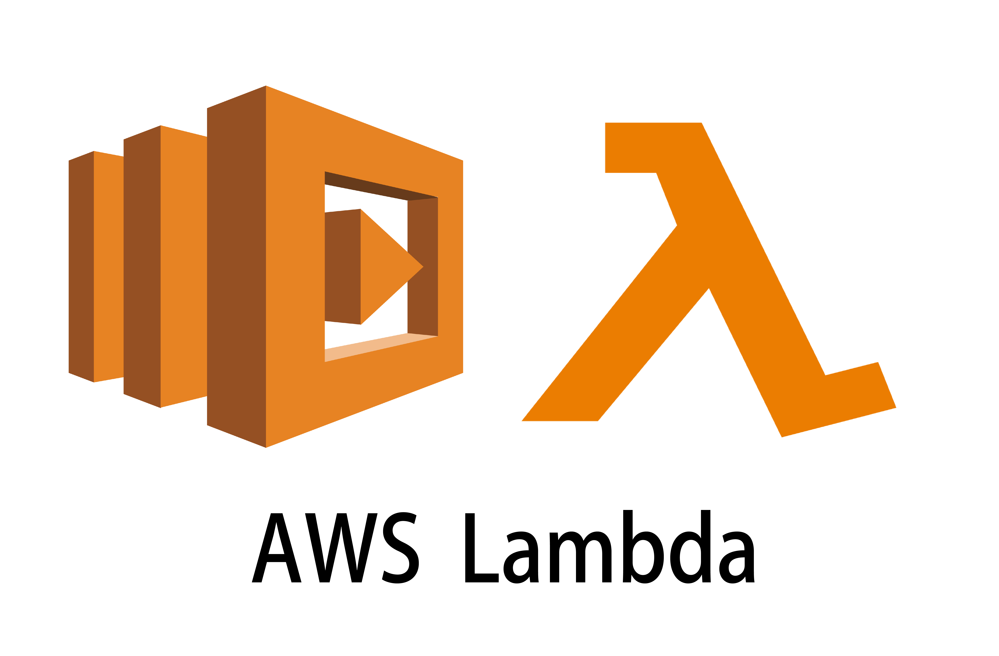
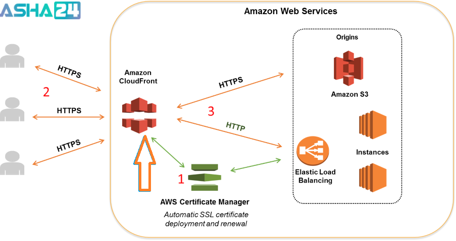

# AWS (Amazone Web Service) Notes

- [AWS (Amazone Web Service) Notes](#aws-amazone-web-service-notes)
  - [The 6 Pillars of AWS](#the-6-pillars-of-aws)
    - [Operational Excellence](#operational-excellence)
    - [Security](#security)
    - [Reliability](#reliability)
    - [Performance Efficiency](#performance-efficiency)
    - [Cost Optimization](#cost-optimization)
    - [Sustainability](#sustainability)
  - [Cloud Adoption Framework (CAF) Perspectives and Foundational Capabilities](#cloud-adoption-framework-caf-perspectives-and-foundational-capabilities)
  - [Migration Strategies](#migration-strategies)
    - [AWS Snowball](#aws-snowball)
    - [AWS Database Migration Service](#aws-database-migration-service)
  - [Cloud services](#cloud-services)
    - [Elastic Compute Cloud (EC2)](#elastic-compute-cloud-ec2)
      - [Why EC2?](#why-ec2)
      - [Real-World Use Cases](#real-world-use-cases)
    - [Lambda](#lambda)
      - [Real-World Use Cases](#real-world-use-cases-1)
  - [Databases services](#databases-services)
    - [AWS SQL Services](#aws-sql-services)
      - [Relational Database Service (RDS)](#relational-database-service-rds)
    - [AWS NoSQL Services](#aws-nosql-services)
    - [Memory Database](#memory-database)
    - [AWS Database Migration Service (DMS)](#aws-database-migration-service-dms)
  - [AWS Storage Services](#aws-storage-services)
    - [Quick Selection Guide](#quick-selection-guide)
  - [Data services](#data-services)
    - [Redshift](#redshift)
    - [Kinesis](#kinesis)
    - [SageMaker](#sagemaker)
  - [Content Delivery Network (CDN) services](#content-delivery-network-cdn-services)
    - [CloudFront](#cloudfront)

## The 6 Pillars of AWS

### Operational Excellence

- Run and fix your systems smoothly
- Real-world example: Write your setups as code. This stops human mistakes when building a server

### Security

- Protect your data and systems
- Real-world example: Lock your house doors. Use passwords and give access only to people who need it

### Reliability

- Keep your system working and fix it fast when things break
- Real-world example: Have backup plans. If one server breaks, another server takes over right away

### Performance Efficiency

- Make your system fast and use the right tools
- Real-world example: Pick a small car for short trips and a big truck for heavy loads. Use the right computer power for the job

### Cost Optimization

- Spend money wisely
- Real-world example: Only pay for what you use. Turn off servers at night if you do not need them

### Sustainability

- Think about the planet
- Real-world example: Use less energy by picking server parts that waste less power

## Cloud Adoption Framework (CAF) Perspectives and Foundational Capabilities

- **Business Perspective**: Makes sure cloud projects help your company save money and reach its goals.
- **People Perspective**: Focuses on training your staff and changing your work culture to use the cloud.
- **Governance Perspective**: Sets rules for managing costs, safety, and risks in the cloud.
- **Platform Perspective**: Helps you build a strong, modern foundation for your tech and apps.
- **Security Perspective**: Keeps your cloud data and servers safe from attacks.
- **Operations Perspective**: Focuses on keeping your apps running smoothly every day.

## Migration Strategies

### AWS Snowball

Accelerate moving offline data or remote storage to the cloud

### AWS Database Migration Service

Trusted by customers to securely migrate 1.5M+ databases with minimal downtime and zero data loss

## Cloud services

### Elastic Compute Cloud (EC2)

- Amazon EC2 (**E**lastic **C**ompute **C**loud) lets you **rent** virtual servers instead of buying physical computers
- Provides secure, resizable virtual servers (**instances**) in the AWS cloud
- You can launch virtual machines, install any software, and scale capacity up or down in minutes
- You pay only for the exact time your servers run

#### Why EC2?

- **Save Money**: You do not have to buy expensive physical hardware
- **Elasticity**: You can launch one server or thousands in minutes to handle busy days
- **Control**: You have full administrator access to the machine

#### Real-World Use Cases

- Hosting Websites
- App Backends and APIs
- Continuous Testing

### Lambda

- A **serverless** compute service
- You upload your code, and it runs automatically in response to triggers
- You do not manage any servers, and you only pay for the exact compute time your code uses

#### Real-World Use Cases

- Automated Media & File Processing
- Serverless Web & Mobile Backends (APIs)
- Real-Time Data Streaming & ETL Pipelines
- Scheduled Automation & Serverless Cron Jobs

## Databases services

### AWS SQL Services

#### Relational Database Service (RDS)

| AWS Service                   | Database Engine               | Primary Use Case                                  | Key Features                                                                                   |
| ----------------------------- | ----------------------------- | ------------------------------------------------- | ---------------------------------------------------------------------------------------------- |
| **Amazon RDS for MySQL**      | MySQL                         | Web applications, CMS, e-commerce                 | Managed MySQL, automated backups, Multi-AZ, read replicas                                      |
| **Amazon RDS for PostgreSQL** | PostgreSQL                    | Enterprise applications, GIS, analytics           | Advanced SQL features, extensions (PostGIS), Multi-AZ, read replicas                           |
| **Amazon RDS for MariaDB**    | MariaDB                       | Open-source web applications                      | MySQL-compatible, managed service, automated patching and backups                              |
| **Amazon RDS for Oracle**     | Oracle Database               | Enterprise ERP, CRM, business applications        | Managed Oracle, BYOL or license included, Multi-AZ, backups                                    |
| **Amazon RDS for SQL Server** | Microsoft SQL Server          | .NET applications, enterprise workloads           | Managed SQL Server, automated maintenance, high availability                                   |
| **Amazon RDS for Db2**        | IBM Db2                       | Enterprise transactional applications             | Managed Db2, automated backups, scaling, high availability                                     |
| **Amazon Aurora**             | MySQL & PostgreSQL Compatible | High-performance cloud-native relational database | Up to 5× MySQL and 3× PostgreSQL performance, distributed storage, automatic scaling, Multi-AZ |

### AWS NoSQL Services

| AWS Service                | NoSQL Type          | Primary Use Case                                           | Key Features                                                                                                |
| -------------------------- | ------------------- | ---------------------------------------------------------- | ----------------------------------------------------------------------------------------------------------- |
| **Amazon DynamoDB**        | Key-value, Document | Serverless applications, gaming, IoT, e-commerce           | Fully managed, single-digit millisecond latency, automatic scaling, Global Tables                           |
| **Amazon MemoryDB**        | In-memory Key-value | Durable, ultra-fast primary database                       | Redis/Valkey compatible, microsecond reads, multi-AZ durability                                             |
| **Amazon ElastiCache**     | In-memory Key-value | Caching, session storage, real-time leaderboards           | Redis/Valkey & Memcached, microsecond latency, managed cache                                                |
| **Amazon DocumentDB**      | Document            | JSON document storage for applications                     | MongoDB-compatible, managed, highly available                                                               |
| **Amazon Keyspaces**       | Wide-column         | Cassandra workloads at scale                               | Apache Cassandra-compatible, serverless, automatic scaling                                                  |
| **Amazon Neptune**         | Graph               | Knowledge graphs, fraud detection, social networks         | Supports Property Graph & RDF models, optimized graph queries                                               |
| **Amazon Timestream**      | Time-series         | IoT telemetry, application monitoring, operational metrics | Serverless, optimized for time-series data, built-in analytics                                              |
| **Amazon QLDB** _(Legacy)_ | Ledger              | Immutable transaction records                              | Cryptographically verifiable ledger (AWS recommends Amazon Aurora PostgreSQL with Ledger for new workloads) |

### Memory Database

| Feature             | Amazon MemoryDB                       | Amazon ElastiCache                    |
| ------------------- | ------------------------------------- | ------------------------------------- |
| **Primary Purpose** | Durable primary database              | Transient data caching                |
| **Read Latency**    | Microseconds                          | Microseconds                          |
| **Write Latency**   | Single-digit milliseconds             | Microseconds                          |
| **Data Durability** | Built-in via multi-AZ transaction log | Ephemeral (data can be lost on reset) |
| **Engines**         | Valkey, Redis OSS                     | Valkey, Redis OSS, Memcached          |

### AWS Database Migration Service (DMS)

## AWS Storage Services

| Service                              | Storage Type                 | Best For                                          | Durability / Availability                     | Key Features                                                               |
| ------------------------------------ | ---------------------------- | ------------------------------------------------- | --------------------------------------------- | -------------------------------------------------------------------------- |
| **Amazon S3**                        | Active Object Storage        | Backups, static websites, data lakes, media files | 99.999999999% (11 9's) durability             | Scalable, versioning, lifecycle policies, encryption, event notifications  |
| **Amazon S3 Glacier**                | Archive Object Storage       | Long-term data archiving                          | 11 9's durability                             | Low-cost archival, multiple retrieval options, compliance support          |
| **Amazon EBS (Elastic Block Store)** | Block Storage                | EC2 instance volumes, databases                   | High availability within an Availability Zone | SSD/HDD options, snapshots, encryption, resize volumes                     |
| **Amazon EFS (Elastic File System)** | File Storage                 | Shared Linux workloads, containers                | Regional, highly available                    | NFS protocol, elastic scaling, shared access across multiple EC2 instances |
| **Amazon FSx**                       | Managed File Storage         | Windows, Lustre, NetApp ONTAP, OpenZFS workloads  | High availability (varies by deployment)      | Native file systems, high performance, managed infrastructure              |
| **AWS Storage Gateway**              | Hybrid Storage               | Connect on-premises environments to AWS           | Depends on backend storage                    | File, volume, and tape gateway options for hybrid cloud                    |
| **AWS Backup**                       | Backup Management            | Centralized backup across AWS services            | Managed service                               | Automated backup policies, compliance, cross-region/account backups        |
| **AWS Snow Family**                  | Data Transfer & Edge Storage | Large-scale data migration and edge computing     | Rugged, secure appliances                     | Offline data transfer, edge processing, petabyte-scale migration           |
| **AWS DataSync**                     | Data Transfer                | Fast online data migration                        | Managed service                               | Automated data synchronization between on-premises and AWS                 |
| **AWS Transfer Family**              | Managed File Transfer        | Secure file transfer using SFTP, FTPS, FTP        | Managed service                               | Integrates with S3 and EFS, supports existing workflows                    |

### Quick Selection Guide

| If you need...                              | Use                 |
| ------------------------------------------- | ------------------- |
| Store files, images, videos                 | Amazon S3           |
| Archive data cheaply                        | Amazon S3 Glacier   |
| Disk for an EC2 instance                    | Amazon EBS          |
| Shared file system for Linux                | Amazon EFS          |
| Managed Windows or specialized file systems | Amazon FSx          |
| Hybrid cloud storage                        | AWS Storage Gateway |
| Centralized backups                         | AWS Backup          |
| Transfer petabytes offline                  | AWS Snow Family     |
| Online data migration                       | AWS DataSync        |
| SFTP/FTP server in AWS                      | AWS Transfer Family |

## Data services

### Redshift

> analytics - data warehousing

### Kinesis

> Real time data movement and analytics

### SageMaker

> Predictive analytics & ML

## Content Delivery Network (CDN) services

### CloudFront

- It caches copies of your files in hundreds of global server locations.
- When a user loads your page, CloudFront sends the file from the closest location.
- This makes loading times very fast.

> Securely deliver content with low latency and high transfer speeds
