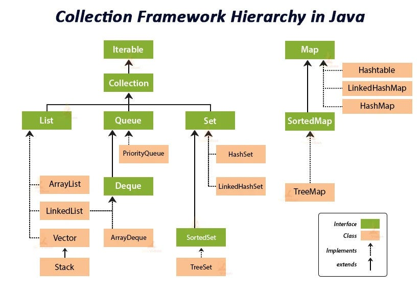

# Java Built In Packages

## Java Lang

The **java.lang** package is a fundamental part of the Java programming language, providing core classes and interfaces essential for basic operations. <mark>It is automatically imported into every Java program</mark>, meaning you don't need to explicitly include it with an import statement.

## Java Utils (java collections framework)



**The Java Collections Framework** is a set of interfaces and classes that provide a unified architecture for representing and manipulating collections. It allows developers to work with groups of objects in an organized and efficient way, reducing development effort and increasing performance.

### Java Collections Framework Hierarchy

- Collections Framework are divided into two basic types: `Collection` and `Map`
- Represented by two interfaces: `java.util.Collection` & `java.util.Map` (Both have several implementing classes)
- import `java.util.*`; to use any of the Collections Framework types

### List interface

- List interface, sub-interface of Collection
  - Defines an ordered group of objects
  - Can contain duplicated objects
- `ArrayList` and `LinkedList` look the same because They share an interface: `List` (An example of polymorphism ("many-forms"))

## Java Streams

### Java.reduce()

In Java, the `Stream.reduce()` method is a terminal operation used to combine the elements of a stream into a single result. It achieves this by repeatedly applying a binary operation (accumulator) to the elements.

- There are **3 main overloads for the reduce()** method:
  - `Optional<T> reduce(BinaryOperator<T> accumulator)`:
    This overload takes a BinaryOperator as an argument, which defines how two elements of the stream are combined.
    It returns an Optional<T> because if the stream is empty, there's no result to return, hence an empty Optional is provided.

    ```Java
    List<Integer> numbers = Arrays.asList(1, 2, 3, 4, 5);
    Optional<Integer> sum = numbers.stream().reduce((a, b) -> a + b);
    sum.ifPresent(s -> System.out.println("Sum: " + s)); // Output: Sum: 15
    ```

  - `T reduce(T identity, BinaryOperator<T> accumulator)`:
    This overload takes an identity value in addition to the BinaryOperator.
    The identity serves as both the initial value for the reduction and the default result if the stream is empty.
    Since an identity is provided, this method returns T directly, not an Optional.

    ```Java
    List<Integer> numbers = Arrays.asList(1, 2, 3, 4, 5);
    int sumWithIdentity = numbers.stream().reduce(0, (a, b) -> a + b);
    System.out.println("Sum with identity: " + sumWithIdentity); // Output: Sum with identity: 15
    ```

  - `U reduce(U identity, BiFunction<U, ? super T, U> accumulator, BinaryOperator<U> combiner)`:
    This overload is used for more complex reductions, especially with parallel streams, where the accumulator might change the type of the elements during reduction, and a combiner is needed to merge the results from different parallel computations.
    - identity: The initial value for the reduction.
    - accumulator: A BiFunction that combines a partial result (U) with the next element from the stream (T) to produce a new partial result (U).
    - combiner: A BinaryOperator that merges two partial results (U) from parallel computations into a single result (U).

    ```Java
    List<String> words = Arrays.asList("hello", "world", "java");
    int totalLength = words.parallelStream().reduce(0,
      (partialLength, word) -> partialLength + word.length(), // accumulator
      (length1, length2) -> length1 + length2); // combiner
    System.out.println("Total length: " + totalLength); // Output: Total length: 15
    ```
