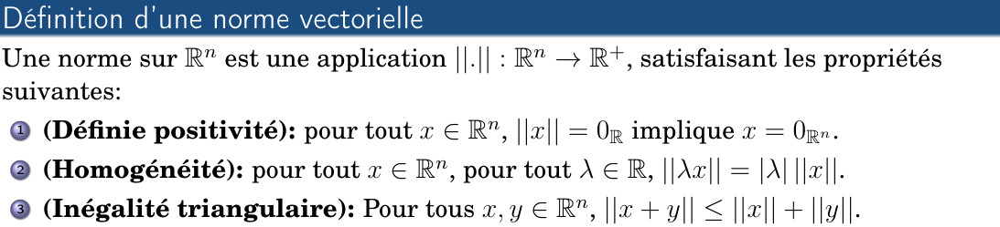
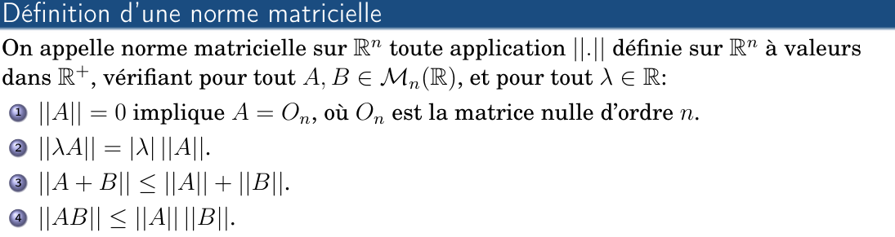
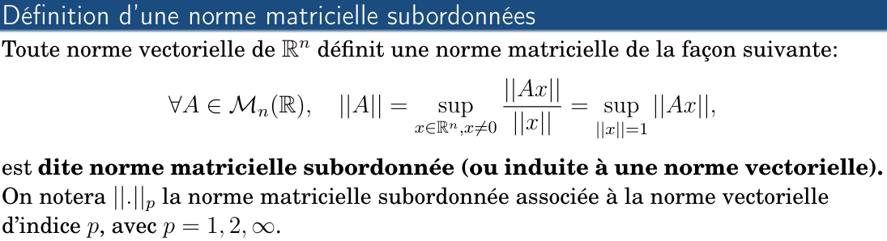

# Résolution numérique de systèmes d’équations linéaires Resume

- **les méthodes de résolution pour des systèmes d’équations linéaires:**
  
- **Système d’équations linéaires:**
  

- **Forme matricielle d’un système linéaire:**
  

- **Existence des solutions:**
  

> [!NOTE]
> (A) matrice carrée, si $\det(A) \neq 0$ ⇔
>
> - $A$ est **inversible**
> - le système linéaire $(S)$ est un **système de Cramer**
> - $(S)$ admet une **solution unique**
> - les colonnes (ou lignes) de $A$ sont **linéairement indépendantes**
> - $\mathrm{rang}(A) = n$ (rang maximal)
> - l’application linéaire associée est **bijective**

## Normes vectorielles et matricielles

### Normes vectorielles

Les normes vectorielles usuelles que l’on utilisera le plus souvent sont:

Soit $x = (x_i)_{1 \le i \le n} \in \mathbb{R}^n$ :

- **Norme 1 (norme de Manhattan)** :
  $$
  \|x\|_1 = \sum_{i=1}^{n} |x_i| = |x_1| + |x_2| + \cdots + |x_n|
  $$
- **Norme euclidienne (norme 2)** :
  $$
  \|x\|_2 = \left( \sum_{i=1}^{n} |x_i|^2 \right)^{1/2}
  = \sqrt{|x_1|^2 + |x_2|^2 + \cdots + |x_n|^2}
  $$
- **Norme infinie (norme du sup)** :
  $$
  \|x\|_\infty = \max_{1 \le i \le n} |x_i|
  = \max \{ |x_1|, |x_2|, \cdots, |x_n| \}
  $$

### Normes matricielles subordonnées

- Définition d’une **norme matricielle**:
  

- Définition d’une **norme matricielle subordonnées**:
  
