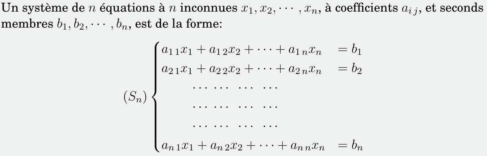
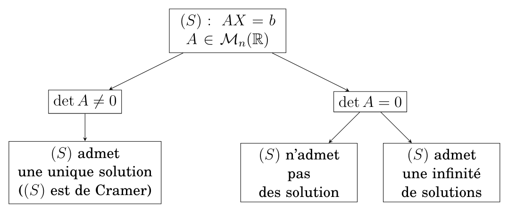

# Résolution numérique de systèmes d’équations linéaires Resume

- **les méthodes de résolution pour des systèmes d’équations linéaires:**
  
- **Système d’équations linéaires:**
  

- **Forme matricielle d’un système linéaire:**
  

- **Existence des solutions:**
  

> [!NOTE]
> (A) matrice carrée, si $\det(A) \neq 0$ ⇔
>
> - $A$ est **inversible**
> - le système linéaire $(S)$ est un **système de Cramer**
> - $(S)$ admet une **solution unique**
> - les colonnes (ou lignes) de $A$ sont **linéairement indépendantes**
> - $\mathrm{rang}(A) = n$ (rang maximal)
> - l’application linéaire associée est **bijective**

## Normes vectorielles et matricielles

### Normes vectorielles

Une norme sur $\mathbb{R}^n$ est une application $||\cdot||: \mathbb{R}^n \to \mathbb{R}^+$ satisfaisant les propriétés suivantes:

1. (**Définie positivité**) : pour tout $x \in \mathbb{R}^n$,
   $||x|| = 0 \Rightarrow x = 0_{\mathbb{R}^n}$
2. (**Homogénéité**) : pour tout $x \in \mathbb{R}^n$, pour tout $\lambda \in \mathbb{R}$,
   $||\lambda x|| = |\lambda|.||x||$
3. (**Inégalité triangulaire**) : pour tous $x, y \in \mathbb{R}^n$,
   $||x + y|| \leq ||x|| + ||y||$

Les normes vectorielles usuelles que l’on utilisera le plus souvent sont:

Soit $x = (x_i)_{1 \le i \le n} \in \mathbb{R}^n$ :

- **Norme 1 (norme de Manhattan)** :
  $$
  \|x\|_1 = \sum_{i=1}^{n} |x_i| = |x_1| + |x_2| + \cdots + |x_n|
  $$
- **Norme euclidienne (norme 2)** :
  $$
  \|x\|_2 = \left( \sum_{i=1}^{n} |x_i|^2 \right)^{1/2}
  = \sqrt{|x_1|^2 + |x_2|^2 + \cdots + |x_n|^2}
  $$
- **Norme infinie (norme du sup)** :
  $$
  \|x\|_\infty = \max_{1 \le i \le n} |x_i|
  = \max \{ |x_1|, |x_2|, \cdots, |x_n| \}
  $$

### Normes matricielles subordonnées

#### Définition d’une norme matricielle

On appelle norme matricielle sur $\mathbb{R}^n$ toute application $||\cdot||$ définie sur $\mathbb{R}^n$ à valeurs dans $\mathbb{R}^+$, vérifiant pour tout $A, B \in \mathcal{M}_n(\mathbb{R})$, et pour tout $\lambda \in \mathbb{R}$:

1. $||A|| = 0 \Rightarrow A = O_n$, où $O_n$ est la matrice nulle d’ordre $n$
2. $||\lambda A|| = ||\lambda||.||A||$
3. $||A + B|| \leq ||A|| + ||B||$
4. $||AB|| \leq ||A||.||B||$

#### Définition d’une norme matricielle subordonnées

Toute norme vectorielle de $\mathbb{R}^n$ définit une norme matricielle de la façon suivante:

$
\forall A \in \mathcal{M}_n(\mathbb{R}), \quad
||A|| = \sup_{x \in \mathbb{R}^n, x \neq 0} \frac{||Ax||}{||x||}
= \sup_{||x|| = 1} ||Ax||
$

est dite **norme matricielle subordonnée** (ou **induite à une norme vectorielle**).
On notera $||\cdot||_p$ la norme matricielle subordonnée associée à la norme vectorielle d’indice $p$, avec $p = 1, 2, \infty$.

#### Normes matricielles usuelles

> [!NOTE]
> Soit $A \in \mathbb{R}^{n\times n}$.
>
> - $||A||_{1} = \displaystyle \sup_{x \neq 0} \frac{||Ax||_{1}}{||x||_{1}} = \max_{j} \sum_{i} |a_{ij}|$
>   (somme maximale des **colonnes**)
> - $||A||_{\infty} = \displaystyle \sup_{x \neq 0} \frac{||Ax||_{\infty}}{||x||_{\infty}} = \max_{i} \sum_{j} |a_{ij}|$
>   (somme maximale des **lignes**)
> - $||A||_{2} = \sqrt{\rho(AA^{\top})}$
>   où $\rho(B) = \max{|\lambda|; \lambda \text{ valeur propre de } B}$ et $\rho$ rayon spectral
>
> **Cas particulier :**
>
> - Si $A$ est **symétrique** ($A = A^{\top}$) :
>   $
>   |A|_{2} = \sqrt{\rho(A^2)} = |\lambda_{\max}| = \rho(A)
>   $
>   (la norme 2 est la **plus grande valeur absolue des valeurs propres** de $A$)

> [!INFO]
> Soit $A \in \mathbb{R}^{n\times n}$, et $\lambda \in \mathbb{R}$.
>
> - On dit que $\lambda$ est une **valeur propre** de $A$ s’il existe un vecteur
>   $v \in \mathbb{R}^n$, avec $v \neq 0$, tel que: $Av = \lambda v$
> - $\lambda$ est une **valeur propre** de $A$ ⇔
>   $\lambda$ est solution de l’équation: $\det(A - \lambda I_n) = 0$

## Méthode du pivot de Gauss

La méthode du pivot de Gauss consiste à transformer un système en un autre système **équivalent** (ayant les mêmes solutions) qui est **triangulaire** et donc facile à résoudre.

### Opérations autorisées pour transformer le système

- Permutation de deux lignes: $L_i \leftrightarrow L_j$
- Multiplication d’une ligne par un scalaire non nul: $L_i \gets \lambda L_i, \quad \lambda \neq 0$
- Addition d’un multiple d’une ligne à une autre: $L_i \gets L_i + \lambda L_j$

## Méthode de décomposition LU

Soit un système d’équations linéaires $S$ défini par:
$$(S) : AX = b$$
où $A$ est une matrice dont tous les mineurs principaux sont **non nuls**.

### Mineur principal

Soit $p \in \mathbb{N}^*$.
On appelle **mineur principal** $M_{p,p}$ de $A$ le déterminant de la sous-matrice de $A$ formée des $p$ premières lignes et des $p$ premières colonnes.

> [!TIP]
> Si $A$ est d’ordre $n$, alors elle admet exactement $n$ mineurs principaux $M_{1,1}, M_{2,2}, \dots, M_{n,n}$.

### Le principe de la méthode

1. On écrit: $A = LU$, où $L$ **est triangulaire inférieure** et $U$ **est triangulaire supérieure**.
2. On pose: $Y = UX$, d’où
   $AX = b\Longleftrightarrow LUX = b \Longleftrightarrow LY = b$
3. On résout successivement :
   1. **(Descente)** : résolution du système triangulaire inférieur $LY = b$
   2. **(Remontée)** : résolution du système triangulaire supérieur $UX = Y$
4. Ainsi, la résolution de $AX = b$ se ramène au système :
   $$
   \begin{cases}
   LY = b
   \newline
   UX = Y
   \end{cases}
   $$

### Théorème d’existence

Soit $A$ une matrice dont tous **les mineurs principaux sont non nuls**.

- Alors il $\exist$ deux matrices $L$ et $U$ telles que:
  - $L$ est **triangulaire inférieure** avec des coefficients diagonaux égaux à $1$
  - $U$ est **triangulaire supérieure**
- vérifiant:
  $$A = LU$$
