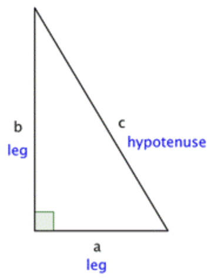

# Notes

## Heron's formula

## The Pythagorean Theorem

- If `a` and `b` are the lengths of the legs of a right triangle and `c` is the length of the hypotenuse, then the sum of the squares of the lengths of the legs is equal to the square of the length of the hypotenuse.
- This relationship is represented by the formula: `a²+b²=c²`

