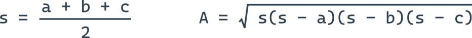
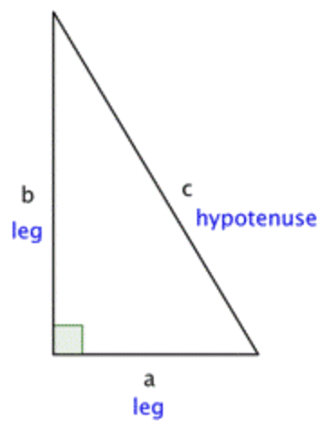
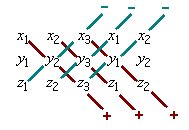

# Notes

> [!NOTE]
> Soit une matrice diagonale $D$ :
>
> $$
> D = \text{diag}(d_1, d_2, \dots, d_n), \quad d_i \neq 0.
> $$
>
> Alors $D$ est inversible et :
>
> $$
> D^{-1} = \text{diag}\left(\frac{1}{d_1}, \frac{1}{d_2}, \dots, \frac{1}{d_n}\right).
> $$
>
> **Exemple**:
>
> $$
> D = \begin{pmatrix}2 & 0 & 0\\0 & 5 & 0\\0 & 0 & -3\end{pmatrix}
> \quad \Rightarrow \quad
> D^{-1} = \begin{pmatrix} \frac{1}{2} & 0 & 0 \\ 0 & \frac{1}{5} & 0 \\ 0 & 0 & -\frac{1}{3} \end{pmatrix}.
> $$

## Heron's formula

## The Pythagorean Theorem

- If `a` and `b` are the lengths of the legs of a right triangle and `c` is the length of the hypotenuse, then the sum of the squares of the lengths of the legs is equal to the square of the length of the hypotenuse.
- This relationship is represented by the formula: `a²+b²=c²`

## Règle de Sarrus

