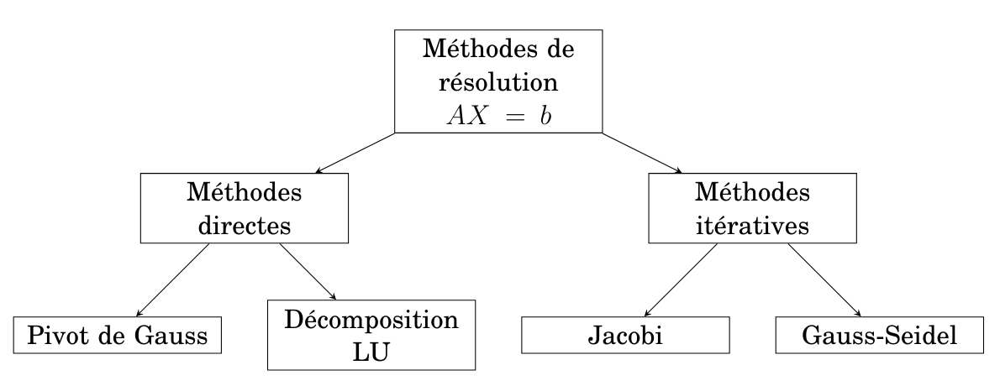
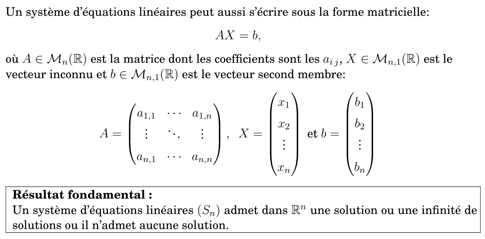

# Résolution numérique de systèmes d’équations linéaires Resume

- **les méthodes de résolution pour des systèmes d’équations linéaires:**
  
- **Système d’équations linéaires:**
  

- **Forme matricielle d’un système linéaire:**
  

- **Existence des solutions:**
  

> [!NOTE]
> (A) matrice carrée , alors :
>
> $\det(A) \neq 0$ ⇔
>
> - $A$ est **inversible**
> - le système linéaire $(S)$ est un **système de Cramer**
> - $(S)$ admet une **solution unique**
> - les colonnes (ou lignes) de $A$ sont **linéairement indépendantes**
> - $\mathrm{rang}(A) = n$ (rang maximal)
> - l’application linéaire associée est **bijective**
