# Module 1: Les Réseaux Aujourd'hui

## Introduction

- **Titre du module**: Mise en Réseau Aujourd'hui
- **Objectif du module**: Expliquer les avancées des technologies réseau modernes.

| Titre du rubrique                       | Objectif du rubrique                                                                                                                         |
| --------------------------------------- | -------------------------------------------------------------------------------------------------------------------------------------------- |
| Les réseaux affectent nos vies          | Expliquer comment les réseaux ont un impact sur notre vie quotidienne.                                                                       |
| Composants réseau                       | Expliquer comment les hôtes et les périphériques réseaux sont utilisés.                                                                      |
| Topologies et représentations du réseau | Expliquer les représentations du réseau et comment elles sont utilisées dans les topologies du réseau.                                       |
| Types courants de réseaux               | Comparer les caractéristiques des types courants de réseaux.                                                                                 |
| Connexions Internet                     | Expliquer comment les réseaux LAN et WAN s'interconnectent à Internet.                                                                       |
| Réseaux fiables                         | Décrivez les quatre exigences de base d'un réseau fiable.                                                                                    |
| Tendances des réseaux                   | Expliquer comment des tendances telles que BYOD, la collaboration en ligne, la vidéo et le cloud computing changent notre façon d'interagir. |
| Sécurité des réseaux                    | Identifier quelques menaces de sécurité de base et une solution pour tous les réseaux.                                                       |
| Professionnel de l'IT                   | Expliquer les possibilités d'emploi dans le domaine des réseaux.                                                                             |

- [logical and physical mode exploration - PKA](res/pka/1.0.5-packet-tracer---logical-and-physical-mode-exploration_fr-FR.pka)
- [logical and physical mode exploration - PDF](res/pdf/packet-tracer-exploration-en-mode-logique-et-physique-1.0.5.pdf)

## Les réseaux affectent nos vies

### Les réseaux nous connectent

- Parmi les éléments essentiels à l'existence humaine, le besoin de communiquer arrive juste après le besoin de survie. Le besoin de communiquer est aussi important pour nous que l'air, l'eau, la nourriture et le gîte.
- Aujourd'hui, grâce aux réseaux, nous sommes plus connectés que jamais. Les personnes qui ont des idées peuvent instantanément communiquer avec d'autres pour les concrétiser. Les événements et les découvertes font le tour du monde en quelques secondes. Il est possible de se connecter et de jouer avec ses amis dans le monde entier.

### L'expérience d'apprentissage Cisco Networking Academy

- La capacité à changer le monde n'est pas un don que l'on reçoit à la naissance. C'est une qualité que l'on acquiert. Depuis 1997, Cisco Networking Academy travaille dans un seul but : l'éducation et le développement des compétences de la prochaine génération de talents nécessaires à l'économie numérique.

### Plus de frontières

- Les avancées en matière de technologies réseau constituent probablement les facteurs d'évolution les plus importants dans le monde actuel. Ils contribuent à créer un monde dans lequel les frontières nationales, les distances géographiques et les limitations physiques perdent de leur pertinence et présentent des obstacles de plus en plus petits.
- L'internet a changé la manière dont se déroulent nos interactions sociales, commerciales, politiques et personnelles. La nature immédiate des communications sur l'internet encourage la création de communautés mondiales. Les communautés internationales permettent des interactions sociales pour lesquelles géographie et fuseaux horaires n’ont aucune importance.
- La création de communautés en ligne échangeant idées et informations peut potentiellement accroître les occasions d'améliorer la productivité sur l'ensemble du globe.
- La création du cloud nous permet de stocker des documents et des images et d'y accéder n'importe où et n'importe quand. Ainsi, que nous soyons dans un train, dans un parc ou au sommet d'une montagne, nous pouvons accéder en toute transparence à nos données et applications sur n'importe quel appareil.

## Composants réseau

### Rôles d'hôte

- Dans un réseau informatique, un **hôte** (ou **host**) est tout appareil connecté (ordinateur, serveur, imprimante IP) qui envoie ou reçoit des informations.
- Son rôle principal est de faciliter la communication, de traiter des données et de partager des ressources.
- Les hôtes agissent soit comme des **clients** demandeurs de services, soit comme des serveurs fournissant des ressources.

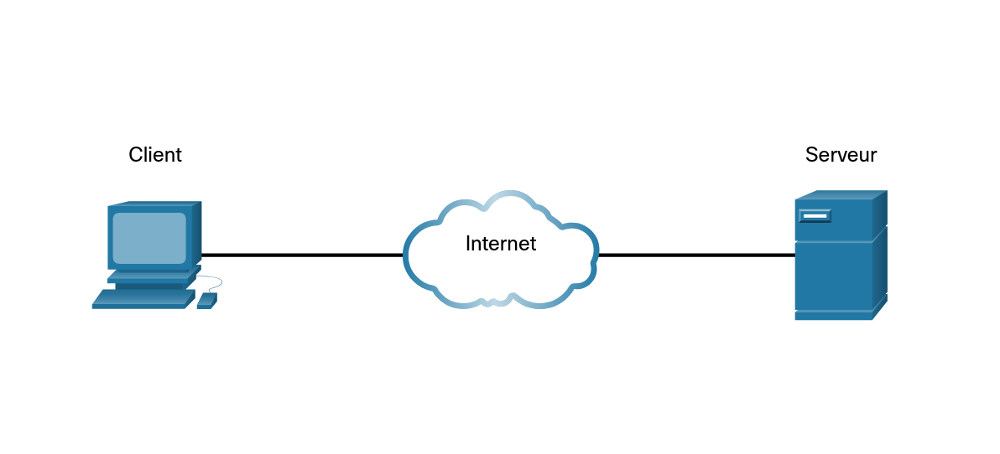

#### Logiciel Client

- **Fonction**: Interface avec l'utilisateur, envoie des requêtes, affiche les résultats (ex: Navigateur Web, application mobile).
- **Types**:
  - Client léger : Peu de traitements, dépend presque entièrement du serveur (ex: navigateur web affichant du HTML/JS).
  - Client lourd : Effectue une partie des calculs et traitements localement avant d'envoyer les données au serveur.
- **Exemples**: Google Chrome, Microsoft Outlook, applications de banque.

#### Logiciel Serveur

- **Fonction**: Attend les requêtes, traite les données, gère la base de données et fournit les services demandés.
- **Caractéristiques**: Puissant, haute disponibilité, héberge les données centralisées.
- **Exemples**: Serveurs Web (Apache, Nginx), serveurs de base de données (MySQL, Oracle, PostgreSQL), serveurs d'e-mail.

### Peer-to-peer

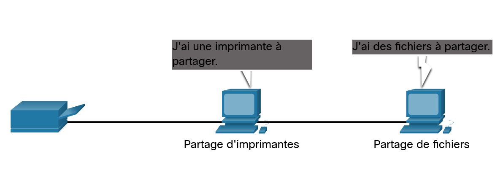

- Les réseaux pair-à-pair (**P2P**) sont des architectures décentralisées où chaque ordinateur (« pair ») **agit simultanément comme client et serveur**, partageant directement des ressources (fichiers, puissance de calcul) sans passer par un serveur central.
- Contrairement au modèle client-serveur, le P2P offre une grande résilience, si un nœud tombe en panne, le réseau survit.
- Avantages et Inconvénients:

  | Avantages                      | Inconvénients                     |
  | ------------------------------ | --------------------------------- |
  | Haute disponibilité            | Sécurité difficile à contrôler    |
  | Résilience                     | Débits potentiellement plus lents |
  | Réduction des coûts de serveur | Gestion complexe                  |
  | Décentralisation               |                                   |

### Périphériques finaux

- Les périphériques finaux (ou **hôtes**/**terminaux**) sont les points de terminaison d'un réseau informatique, servant d'interface directe avec l'utilisateur ou de source/destination des données.
- Ils incluent ordinateurs, smartphones, serveurs, téléphones IP, imprimantes et objets connectés (IoT).
- Ces équipements se connectent au réseau via des périphériques intermédiaires.
- Caractéristiques des périphériques finaux :
  - **Source et Destination**: Ils génèrent ou reçoivent des données (ex: charger une page web, envoyer un email).
  - **Adresse Réseau**: Chaque périphérique final possède une adresse IP unique.
  - **Interface Utilisateur**: Ils permettent à l'utilisateur d'interagir avec le réseau

### Équipements actifs

- Les équipements actifs sont des composants électroniques essentiels au fonctionnement d'un réseau informatique, chargés d'amplifier, de convertir ou de diriger les signaux de données.
- Ils gèrent activement le trafic, contrairement aux éléments passifs (câbles, panneaux de brassage).
- Exemples: commutateurs (switches), routeurs, pare-feu (firewall), bornes Wi-Fi.
- Caractéristiques Clés:
  - **Alimentation électrique**: Ces appareils nécessitent de l'énergie pour fonctionner.
  - **Gestion des données**: Ils traitent, analysent et acheminent les trames.
  - **Performance**: Leur choix est crucial pour la vitesse et la fiabilité du réseau.
  - **Administration**: Souvent configurables pour optimiser le trafic (VLAN, QoS, etc.).

> [!NOTE]
>
> - Remarque: Non affiché est un **hub Ethernet hérité**. Un **concentrateur Ethernet** est également appelé **répéteur multiport**.

- Les répéteurs régénèrent et retransmettent les signaux de communication.

> [!NOTE]
> Notez que tous les dispositifs intermédiaires remplissent la fonction de répéteur.

### Supports réseau

- Les supports réseau sont les moyens physiques ou immatériels utilisés pour transporter des données **sous forme de signaux** (électriques, lumineux ou ondes) entre des périphériques, constituant la couche physique du réseau.
- On distingue principalement les supports **filaires** (paires torsadées, coaxiaux, fibre optique) et les supports **sans fil** (Wi-Fi, ondes hertziennes).
- Principaux supports de transmission:
  - **Paires torsadées (cuivre)**: Utilisées couramment dans les réseaux locaux (LAN) (type RJ45). Elles existent en version _non blindée_ (UTP) ou _blindée_ (STP/FTP) pour réduire les interférences.
  - **Câble coaxial**: Utilisé traditionnellement, il est composé d'un conducteur central en cuivre protégé contre les interférences.
  - **Fibre optique**: Support en verre ou plastique transportant les données sous forme d'impulsions lumineuses. Idéal pour les très hauts débits et longues distances, insensible aux parasites électromagnétiques.
  - **Sans fil (Wireless)**: Utilise les ondes électromagnétiques (radio, infrarouge, micro-ondes) pour la transmission, incluant le Wi-Fi, le Bluetooth et les réseaux cellulaires.

## Topologies et représentations du réseau

- Les représentations du réseau (ou diagrammes de topologie), utilisent des symboles standardisés pour visualiser l'agencement **physique** et **logique** des périphériques (ordinateurs, routeurs, commutateurs) et leurs connexions.
- Elles distinguent la structure physique (emplacement réel) de la topologie logique (flux de données) pour la gestion et le dépannage.

### Types de représentations du réseau

- **Diagramme de topologie physique**: Identifie l'emplacement physique des périphériques, les ports et le câblage, comme décrit dans ce cours sur la topologie des réseaux.
  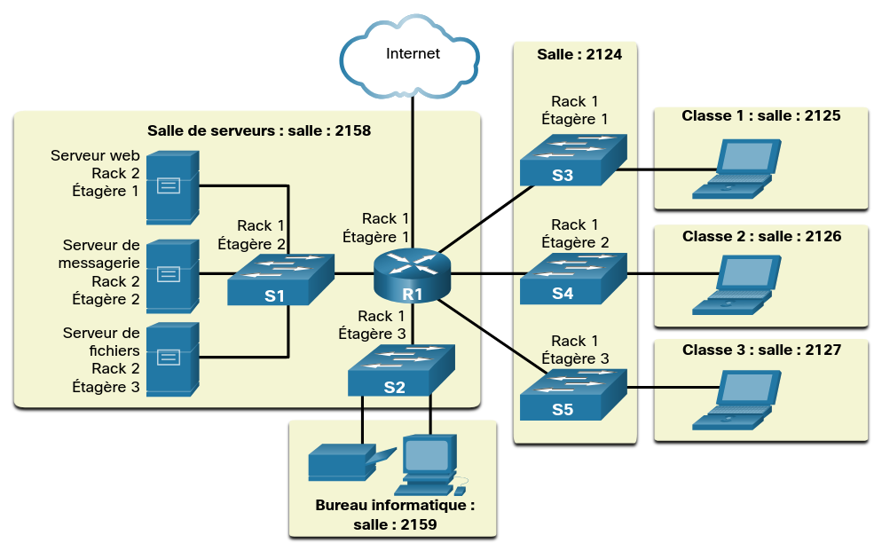
- **Diagramme de topologie logique**: Illustre la manière dont les données circulent, les sous-réseaux et les périphériques finaux, utile pour comprendre le fonctionnement du réseau.
  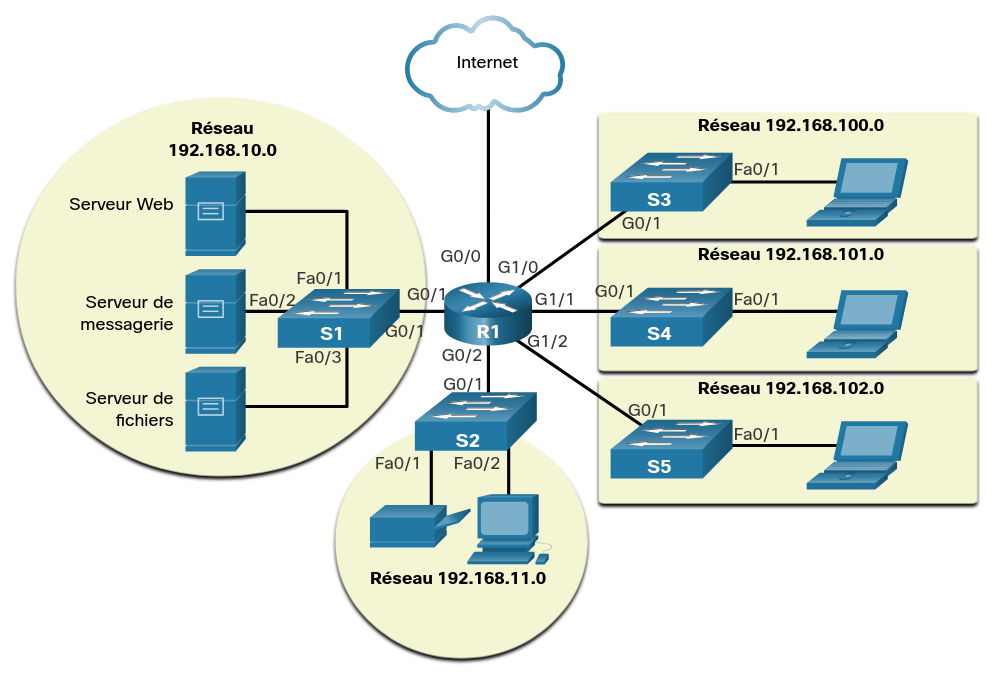

### Principales topologies physiques

- **Etoile**: Chaque appareil est connecté à un concentrateur central (hub/switch).
- **Bus**: Tous les nœuds sont reliés à un seul câble principal.
- **Anneau**: Les stations sont connectées en boucle.
- **Maillée (Mesh)**: Les périphériques sont interconnectés, offrant une haute redondance.
- **Hiérarchique (Arbre)**: Une structure en niveaux, combinant souvent des topologies en étoile.

### Composants clés à représenter

- **Périphériques finaux**: Ordinateurs, imprimantes, serveurs.
- **Périphériques intermédiaires**: Routeurs, commutateurs (switches), pare-feu.
- **Supports de connexion**: Câbles, connexions sans fil.

> [!NOTE]
>
> - Une **NIC** (**N**etwork **I**nterface **C**ard) est un composant matériel, sous forme de carte ou de puce, qui connecte un ordinateur ou un appareil à un réseau (Internet, LAN)
> - Un **port physique** est une interface matérielle concrète, telle qu'une prise, un connecteur ou un slot, située sur un appareil électronique
> - Une **interface réseau** (ou network interface) est le point de connexion matériel ou logiciel permettant à un appareil de communiquer avec un réseau

## Types courants de réseaux

### Réseaux de tailles diverses

- Les réseaux informatiques varient en taille et étendue, allant des connexions personnelles (**PAN**) aux réseaux locaux (**LAN**) d'entreprise, réseaux métropolitains (**MAN**) et réseaux étendus (**WAN**) comme Internet.
- Ces infrastructures relient de deux à des millions de périphériques via des câbles, fibres ou satellites, permettant le partage de ressources

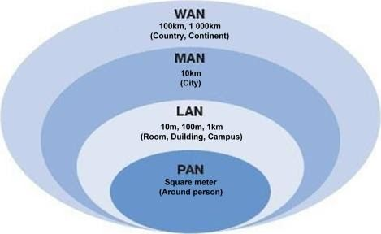

> [!NOTE]
> Les réseaux **SOHO** (Small Office/Home Office) constituent une catégorie spécifique de réseaux de petite taille, conçue pour les maisons et les petits bureaux. sont des réseaux locaux (**LAN**)
> installés dans de petits espaces de travail, tels que des bureaux à domicile, des télétravailleurs ou de petites entreprises (généralement moins de _10-20 personnes_).

### LAN et WAN

- Les réseaux LAN (Local Area Network) et WAN (Wide Area Network) diffèrent principalement par leur étendue géographique et leur vitesse.
- Le LAN connecte des appareils à proximité (bâtiment, maison) avec un haut débit.
- le WAN relie des LAN dispersés géographiquement (villes, pays) à des vitesses généralement plus faibles, Internet étant le plus grand WAN.
- Caractéristiques principales :

  | Type de réseau      | Portée                              | Technologies                                    | Vitesse                                   | Administration / Exemple                                              |
  | ------------------- | ----------------------------------- | ----------------------------------------------- | ----------------------------------------- | --------------------------------------------------------------------- |
  | LAN (Réseau Local)  | Petite (maison, entreprise, campus) | Ethernet (câbles), Wi-Fi                        | Très haut débit (100 à 1000 Mbps et plus) | Souvent privée                                                        |
  | WAN (Réseau Étendu) | Large (villes, pays, continent)     | Fibre optique, satellites, lignes téléphoniques | Généralement plus lente qu'un LAN         | Internet (WAN public), réseaux d'entreprises multi-sites (WAN privés) |

- Différences clés:

  | Critère         | LAN (Local Area Network)                            | WAN (Wide Area Network)                           |
  | --------------- | --------------------------------------------------- | ------------------------------------------------- |
  | Étendue         | Couvre une zone limitée (maison, bureau, école)     | Couvre de grandes distances (pays, continents)    |
  | Connexion       | Relie des appareils au sein d’un même réseau local  | Connecte plusieurs réseaux locaux (LAN) entre eux |
  | Exemple concret | Ordinateur, imprimante et routeur Wi-Fi à la maison | Internet (ex : accès à Google via votre routeur)  |

> [!INFO]
> Le WAN est généralement géré par un fournisseur de services Internet (**ISP**) ou un fournisseur de services réseau (**MSP**)

### Internet

- **L'internet est un ensemble mondial de réseaux interconnectés** (internetworks, ou internet en abrégé).
- La figure montre une façon d'envisager l'internet comme un ensemble de réseaux locaux et étendus interconnectés:
  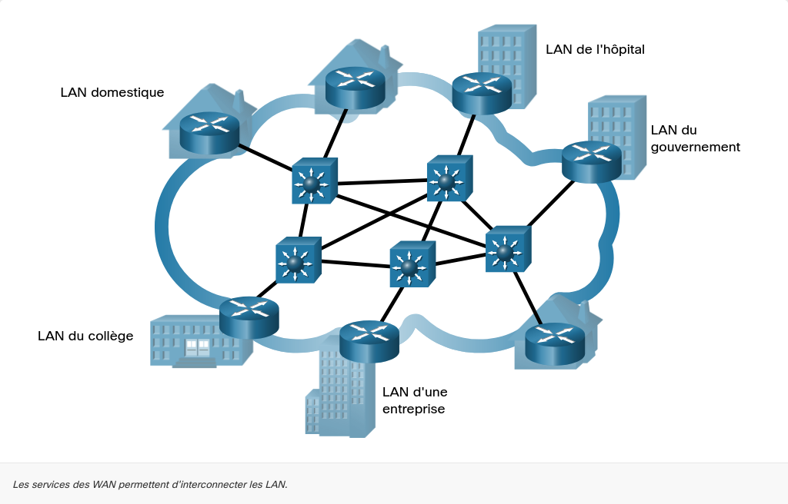
- L'internet n'est la propriété d'aucun individu ou groupe

> [!TIP]
> Il existe des organisations qui ont été développées pour aider à maintenir la structure et la normalisation des protocoles et des processus Internet.
> Ces organismes incluent l'Internet Engineering Task Force (**IETF**), l'Internet Corporation for Assigned Names and Numbers (**ICANN**) et l'Internet Architecture Board (**IAB**), entre autres.

### Intranets et extranets

- **L'intranet** est un réseau privé interne réservé exclusivement aux employés d'une entreprise pour collaborer et partager des informations.
- **L'extranet** est une extension sécurisée de ce réseau, accessible via Internet par des partenaires externes (clients, fournisseurs) autorisés. Ils optimisent la communication interne et la gestion externe.

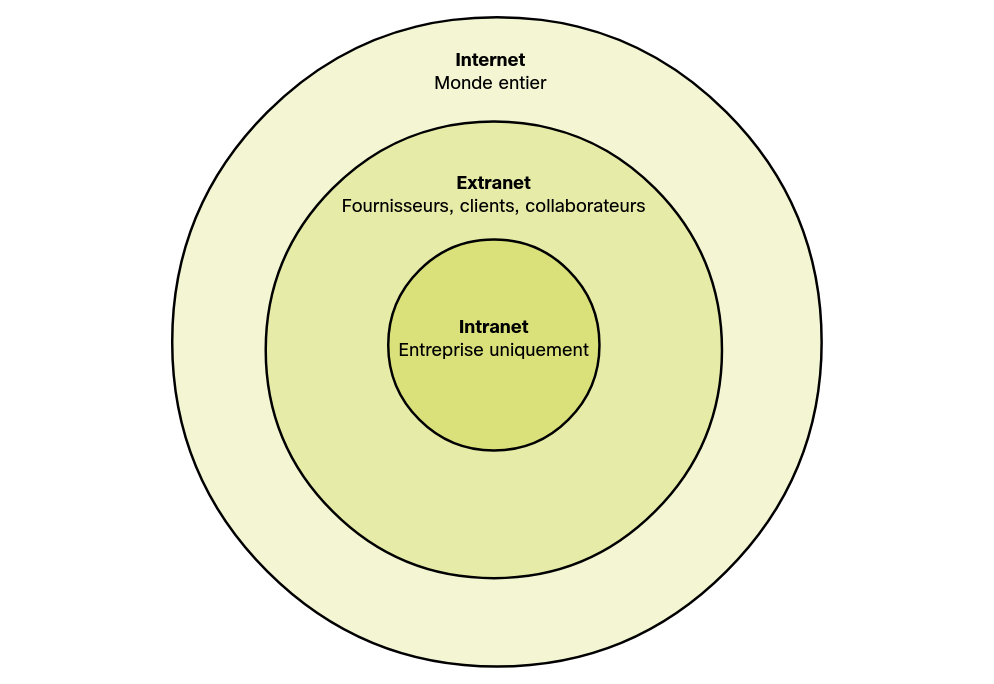

#### Intranets vs extranets

| Critère             | Intranet (Réseau Interne)                                           | Extranet (Réseau Étendu)                                                          |
| ------------------- | ------------------------------------------------------------------- | --------------------------------------------------------------------------------- |
| Objectif            | Communication interne, partage de documents, RH, gestion de projets | Collaboration avec des partenaires, partage de données externes, suivi de projets |
| Public              | Employés et collaborateurs internes uniquement                      | Utilisateurs externes (fournisseurs, clients) et employés autorisés               |
| Sécurité            | Fermé, accessible uniquement depuis le réseau local ou via VPN      | Accessible via Internet avec authentification (identifiant/mot de passe)          |
| Contenu             | Annuaires, politiques RH, actualités de l'entreprise                | Suivi de commandes, accès aux factures, portail client                            |
| Public cible        | Interne                                                             | Partenaires externes                                                              |
| Accès               | Réseau local / VPN                                                  | Internet avec connexion sécurisée                                                 |
| Fonction principale | Collaboration interne                                               | Échange de données externe                                                        |

## Connexions Internet

### Technologie d'accès à Internet

- Les technologies d'accès à Internet permettent de connecter les utilisateurs aux réseaux via des infrastructures filaires ou sans fil, déterminant le débit, la latence et la fiabilité.
- Les principales solutions incluent la fibre optique (FTTH/FTTB) pour le très haut débit, l'ADSL/VDSL via le réseau cuivre, le câble (coaxial), la 4G/5G fixe, et le satellite.
- Le choix dépend de la localisation et de l'infrastructure disponible.

### Connexions Internet des bureaux à domicile et des petits bureaux

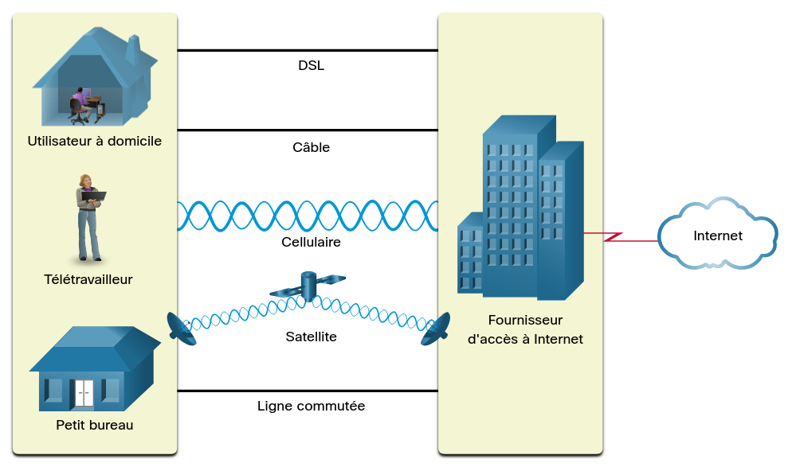

- Les options de connexion courantes:
  - **Câble**: Généralement proposé par les fournisseurs de services de télévision par câble, le signal de données Internet est transmis sur le même câble que celui qui achemine la télévision par câble. Il offre une large bande passante, une grande disponibilité et une connexion permanente à l'internet.
  - **DSL**: Les lignes d'abonné numériques DSL offrent également une large bande passante, une grande disponibilité et une connexion permanente à l'internet. La technologie DSL utilise une ligne téléphonique. En général, un utilisateur de bureau à domicile ou de petit bureau se connecte à l'aide d'une ligne ADSL (Asymmetric Digital Subscriber Line), sur laquelle la vitesse descendante est supérieure à la vitesse ascendante.
  - **Cellulaire**: L'accès à Internet par téléphone cellulaire utilise un réseau de téléphonie mobile pour se connecter. Partout où vous captez un signal cellulaire, vous pouvez accéder à Internet. Les performances sont limitées par les capacités du téléphone et de la tour de téléphonie cellulaire à laquelle il est connecté.
  - **Satellite**: La disponibilité de l'accès à l'internet par satellite est un avantage dans les régions qui, autrement, n'auraient aucune connectivité internet. Les antennes paraboliques nécessitent une ligne de vue claire vers le satellite.
  - **Ligne commutée**: Une option peu coûteuse qui utilise n'importe quelle ligne téléphonique et un modem. La faible bande passante des connexions par ligne commutée n'est généralement pas suffisante pour les transferts de données importants, mais cette solution reste utile pour accéder à Internet lors d'un déplacement.

### Connexions Internet d'entreprise

- Les options de connexion pour les entreprises sont différentes des options disponibles pour les utilisateurs à domicile.
- Les entreprises peuvent nécessiter une bande passante plus élevée, une bande passante spécialisée et des services gérés.
- Les options de connexion disponibles diffèrent selon le type de fournisseurs de services situés à proximité.

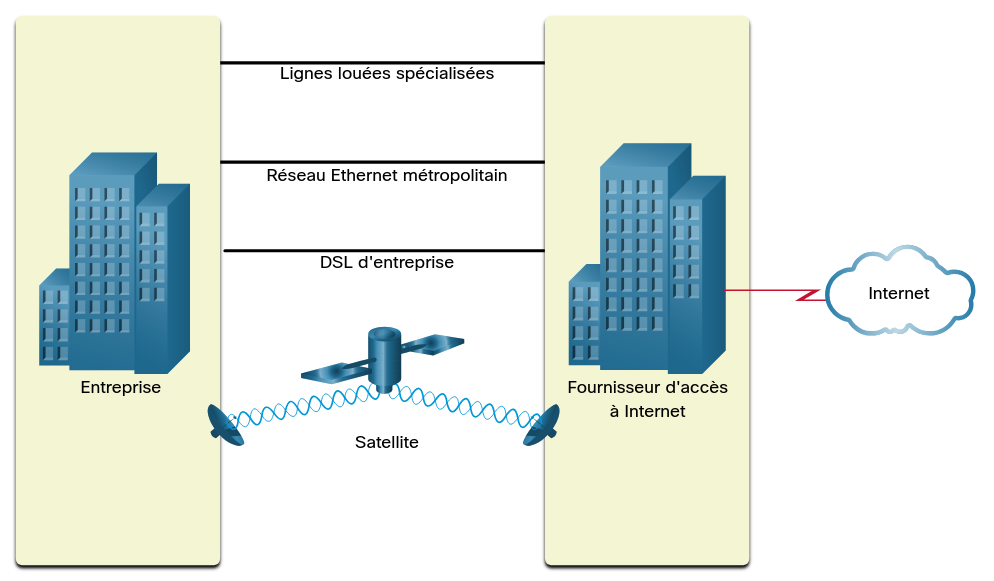

- Les options de connexion communes pour les entreprises:
  - **Ligne louée dédiée** - Les lignes louées sont des circuits réservés au sein du réseau du fournisseur de services qui relient des bureaux géographiquement séparés pour un réseau privé de voix et/ou de données. Les circuits sont généralement loués sur une base mensuelle ou annuelle.
  - **Metro Ethernet** - Ceci est parfois connu sous le nom Ethernet WAN. Dans ce module, nous l'appellerons Metro Ethernet. Les Metro ethernets étendent la technologie d'accès au LAN au WAN. Ethernet est une technologie LAN que vous découvrirez dans un autre module.
  - **Business DSL** - Business DSL est disponible dans différents formats. Un choix populaire est la ligne d'abonné numérique symétrique (SDSL) qui est similaire à la version grand public de la DSL mais qui permet les téléchargements en amont et en aval aux mêmes vitesses élevées.
  - **Satellite** - Le service par satellite peut fournir une connexion lorsqu'une solution câblée n'est pas disponible.

> [!NOTE]
> Le choix de la connexion dépend de l'emplacement géographique et de la disponibilité du fournisseur d'accès.

### Réseau convergent

#### Réseaux séparés traditionnels

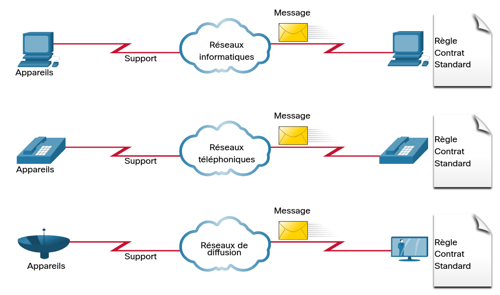

- Les réseaux séparés traditionnels utilisent du matériel physique dédié (commutateurs, routeurs) pour isoler des segments de trafic, offrant une sécurité accrue mais une gestion complexe et décentralisée.
- Chaque réseau utilisait des technologies différentes pour le transport du signal de communication
- Chaque réseau avait son propre ensemble de règles et de normes pour garantir le bon fonctionnement des communications.
- Plusieurs services s'exécutent sur plusieurs réseaux.

#### Réseaux convergents

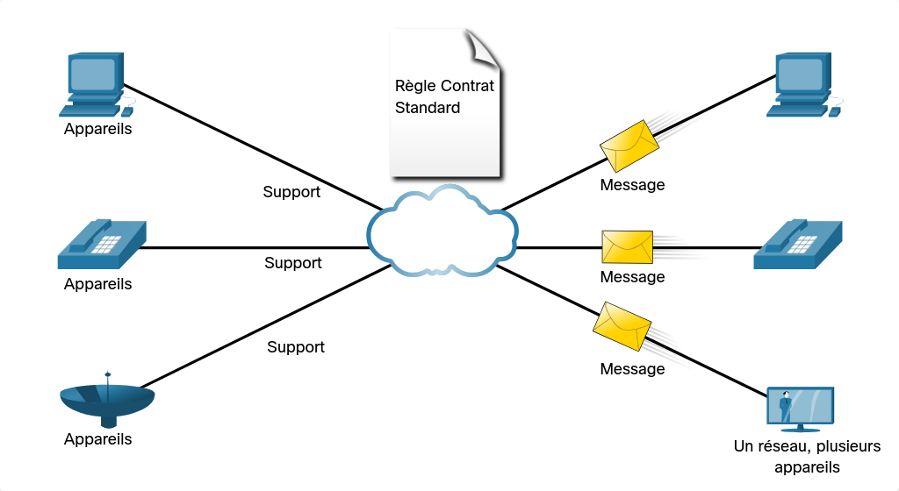

- Aujourd'hui, les réseaux distincts de données, de téléphone et de vidéo convergent.
- Contrairement aux réseaux spécialisés, les réseaux convergents sont capables de transmettre des données, de la voix et de la vidéo entre de nombreux types d'appareils différents sur la même infrastructure de réseau.
- Cette infrastructure réseau utilise le même ensemble de règles, de contrats et de normes de mise en œuvre.
- Les réseaux de données convergents exécutent plusieurs services sur un même réseau.

[Représentation Du Réseau - PKA](res/pka/représentation-du-réseau.pka)
[Représentation Du Réseau - PDF](res/pdf/représentation-du-réseau.pdf)

## Réseaux fiables
