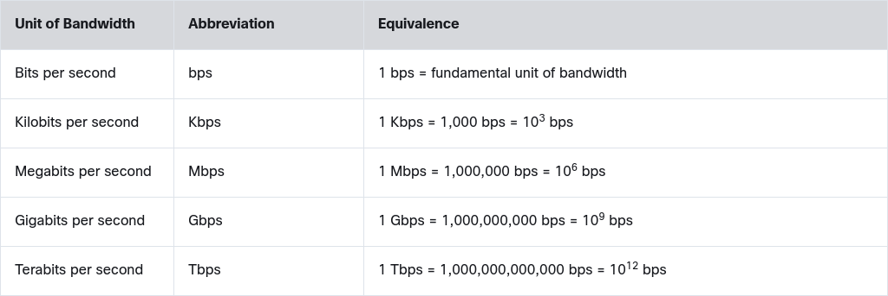

# Module 1: Communication in a connected world

## Networks types

### Local Networks

- Small Home Networks
- Small Office and Home Office Networks (SOHO)
- Medium to Large Networks
- World Wide Networks

### Mobile Devices

- Smartphone
- Tablet
- Smartwatch
- Smart Glasses

### Connected Home Devices

- Security System
- Appliances
- Smart TV
- Gaming Console

### Other Connected Devices

- Smart Cars
- RFID Tags
- Sensors and Actuators
- Medical Devices

## Data Transmission

### The Bit

- The term bit is an abbreviation of **binary digit** and represents the smallest piece of data.
- Each bit can only have one of two possible values, `0` or `1`.
- Every input device (mouse, keyboard, voice-activated receiver) will translate human interaction into binary code for the CPU to process and store.
- Every output device (printer, speakers, monitors, etc.) will take binary data and translate it back into human recognizable form.
- Computers use binary codes to represent and interpret letters, numbers and special characters with bits.
- A commonly used code is the **A**merican **S**tandard **C**ode for **I**nformation **I**nterchange (**ASCII**).
- With ASCII, each character is represented by **eight bits**.
- Each group of eight bits, such as the representations of letters and numbers, is known as a **byte**.

### Common Methods of Data Transmission

There are three common methods of signal transmission used in networks:

- **Electrical signals** - Transmission is achieved by representing data as electrical pulses on copper wire.
- **Optical signals** - Transmission is achieved by converting the electrical signals into light pulses.
- **Wireless signals** - Transmission is achieved by using infrared, microwave, or radio waves through the air.

## Bandwidth and Throughput

### Bandwidth

- Bandwidth is the maximum rate at which data can be transferred over a network connection

- Typically measured in **bits per second** (bps, Mbps, Gbps). It defines the capacity, rather than the raw speed, of a network to move data

### Throughput

- Throughput is the actual rate at which a system processes or delivers data, goods, or tasks within a specific time frame, acting as a key indicator of efficiency.
- Unlike maximum capacity (bandwidth), throughput measures real-world performance, often affected by congestion, latency, or bottlenecks.
- Many factors influence throughput including:
  - The amount of data being sent and received over the connection
  - The types of data being transmitted
  - The latency created by the number of network devices encountered between source and destination
