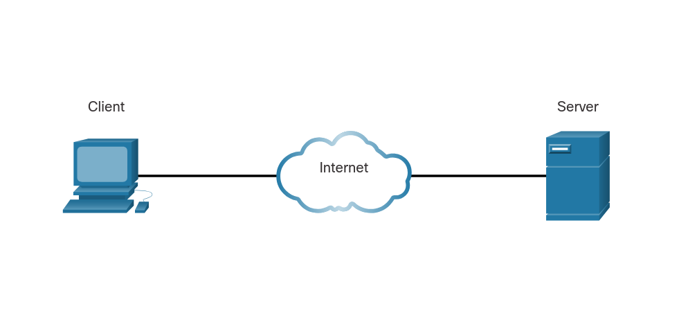
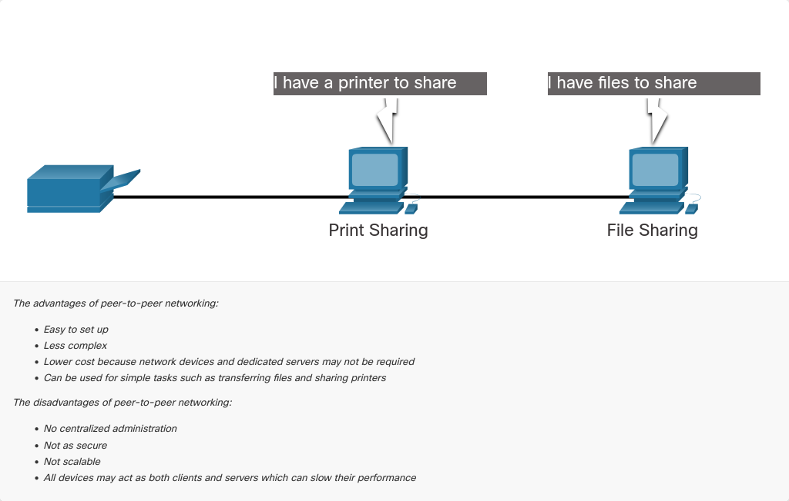
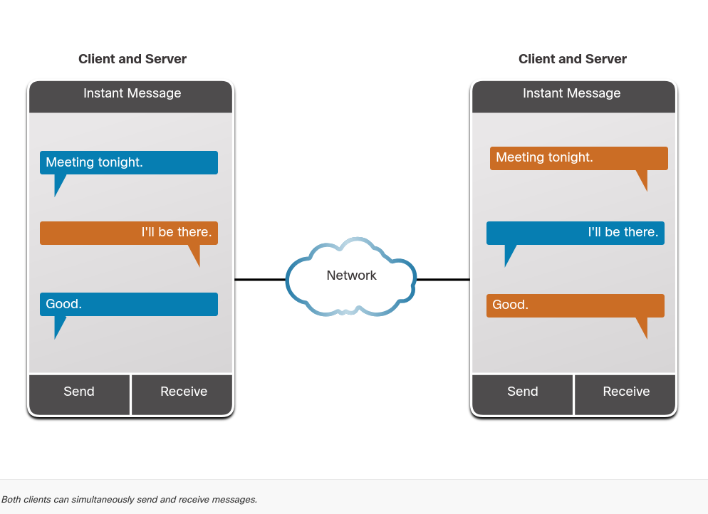
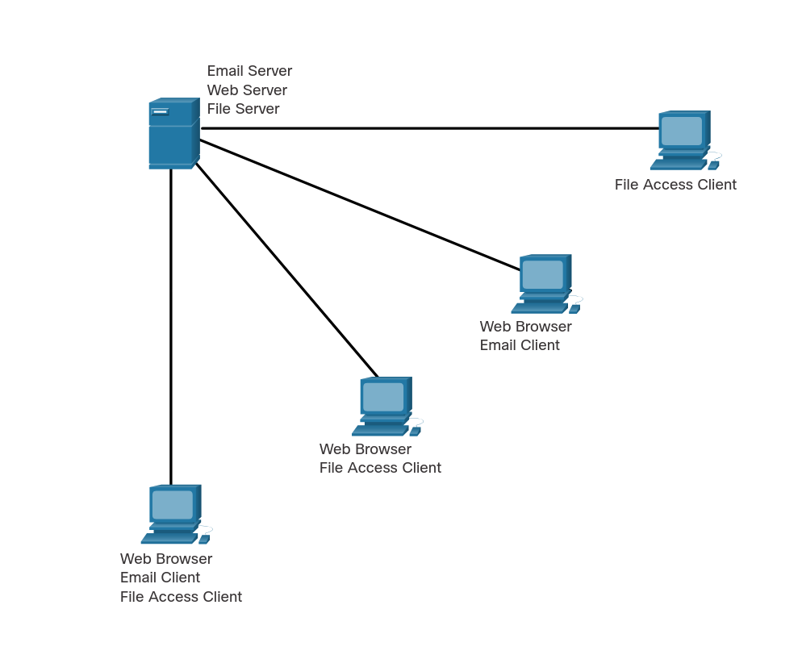
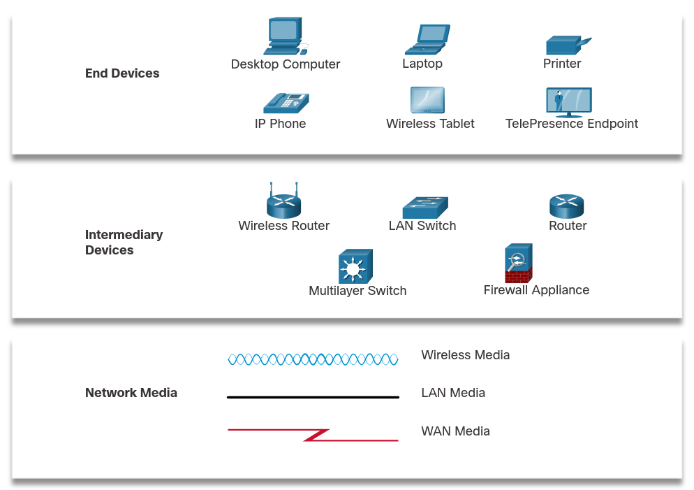
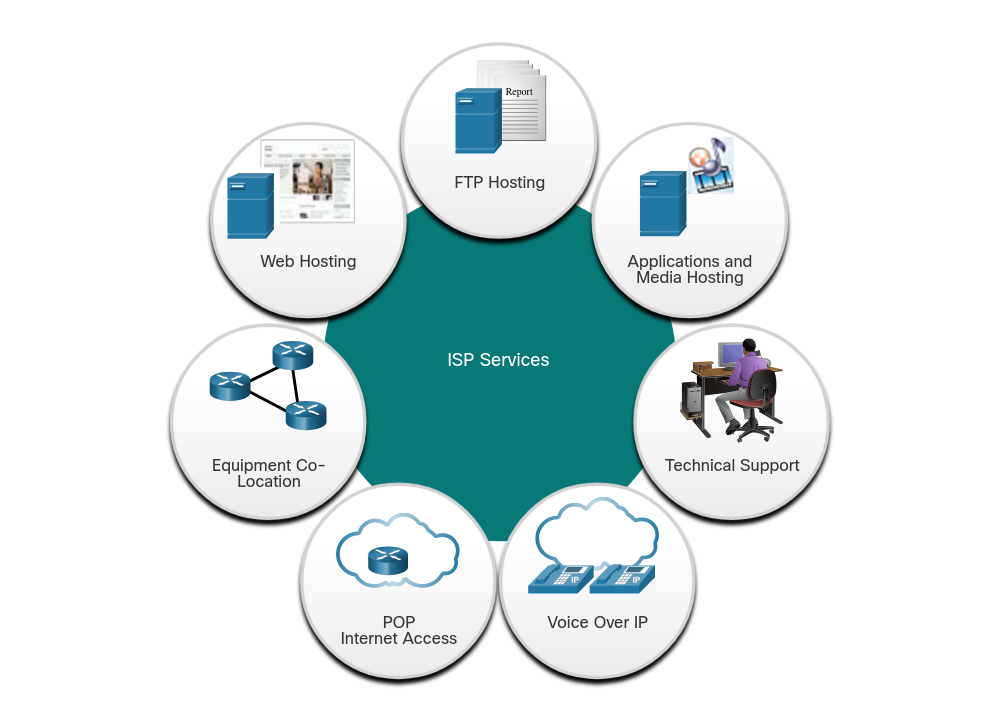
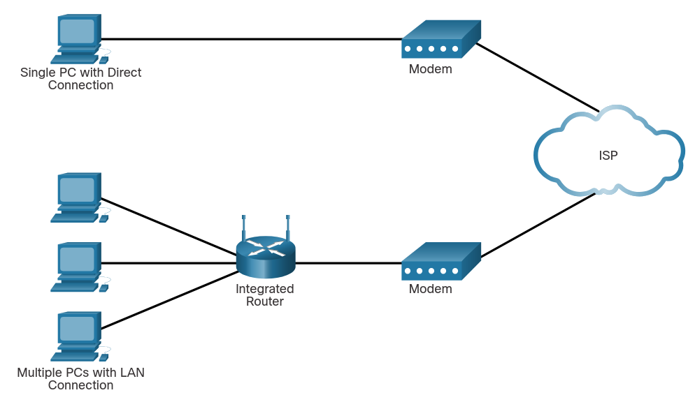
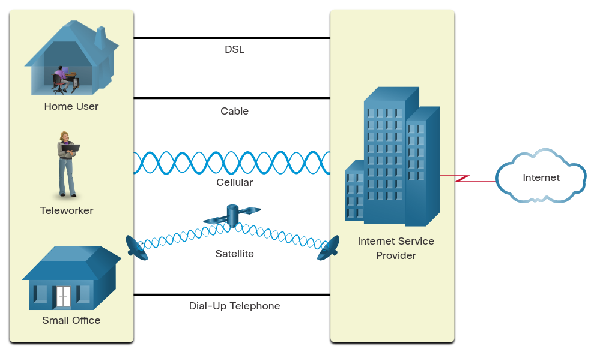

# Module 2: Network Components, Types and Connections

## Clients ans servers

### Client and Server Roles

- All computers connected to a network that participate directly in network communication are classified as hosts.
- **Hosts** can send and receive messages on the network.
- In modern networks, computer hosts can act as a client, a server, or both, as shown in the figure.
- The software installed on the computer determines which role the computer plays.
- A **server** is a computer or software system that provides data, resources, or services to other computers called "clients" on a computer network.

### Peer-to-Peer Networks

- A **peer-to-peer (P2P) network** is a decentralized IT infrastructure where individual computers (nodes/peers) connect directly to share resources—such as files, bandwidth, or processing power—without a central server.
- Each node acts as **both a client and a server**, enhancing efficiency and resilience but making them best suited for smaller, decentralized setups or file-sharing applications

### Peer-to-Peer Applications

- A **peer-to-peer (P2P) application** is a software program allowing decentralized, direct communication or transactions between users' devices without a central server.
- Popular for file sharing (e.g., BitTorrent) and instant payments (e.g., Venmo), they offer high efficiency but require strong security to manage risks.
- Key examples include Zelle, Cash App, and PayPal.

### Multiple Roles in the Network

- A computer with server software can provide services simultaneously to one or many clients
- A single computer can run multiple types of client/server software

## Network Components

### Network Infrastructure

- The network infrastructure contains three categories of hardware components:
  - End devices
  - Intermediate devices
  - Network media

- In the case of wireless media, messages are transmitted through the air using invisible radio frequencies or infrared waves.

### End Devices

- The network devices that people are most familiar with are called end devices, or hosts.
- These devices form the interface between users and the underlying communication network.
- Some examples of end devices are as follows:
  - Computers (workstations, laptops, file servers, web servers)
  - Network printers
  - Telephones and teleconferencing equipment
  - Security cameras
  - Mobile devices (such as smart phones, tablets, PDAs, and wireless debit/credit card readers and barcode scanners)

- An end device (or host) is either the source or destination of a message transmitted over the network.
- In order to uniquely identify hosts, addresses are used.

## ISP Connectivity Options

### ISP Services

- An Internet Service Provider (ISP) provides the link between the home network and the internet.
- An ISP can be the local cable provider, a landline telephone service provider, the cellular network that provides your smartphone service, or an independent provider who leases bandwidth on the physical network infrastructure of another company.
- ISPs are connected in a hierarchical manner that ensures that internet traffic generally takes the shortest path from the source to the destination.
- The internet backbone is like an information super highway that provides high-speed data links to connect the various service provider networks in major metropolitan areas around the world.

### ISP Connections

- The interconnection of ISPs that forms the backbone of the internet is a complex web of fiber-optic cables with expensive networking switches and routers that direct the flow of information between source and destination hosts.Multiple

> [!NOTE]
> The top portion of the figure displays the simplest ISP connection option. It consists of a modem that provides a direct connection between a computer and the ISP. This option should not be used though, because your computer is not protected on the internet.

> [!IMPORTANT]
> A router is required to securely connect a computer to an ISP. This is the most common connection option. It consists of using a wireless integrated router to > connect to the ISP. The router includes a switch to connect wired hosts and a wireless AP to connect wireless hosts. The router also provides client IP
> addressing information and security for inside hosts.

### Cable and DSL Connections

- The figure illustrates common connection options for small office and home users:
  

- The two most common methods are as follows:

#### **Cable**

Typically offered by cable television service providers, the internet data signal is carried on the same coaxial cable that delivers cable television. It provides a high bandwidth, always on, connection to the internet. A special cable modem separates the internet data signal from the other signals carried on the cable and provides an Ethernet connection to a host computer or LAN.

#### **DSL**

- Digital Subscriber Line provides a high bandwidth, always on, connection to the internet. It requires a special high-speed modem that separates the DSL signal from the telephone signal and provides an Ethernet connection to a host computer or LAN.
- DSL runs over a telephone line, with the line split into three channels:
  - One channel is used for voice telephone calls. This channel allows an individual to receive phone calls without disconnecting from the internet.
  - A second channel is a faster download channel, used to receive information from the internet.
  - The third channel is used for sending or uploading information. This channel is usually slightly slower than the download channel.
- The quality and speed of the DSL connection depends mainly on the quality of the phone line and the distance from the central office of your phone company The farther you are from the central office, the slower the connection.

### Additional Connectivity Options

Other ISP connection options for home users include the following:

- cellular
- Satellite
- Dial-up Telephone
